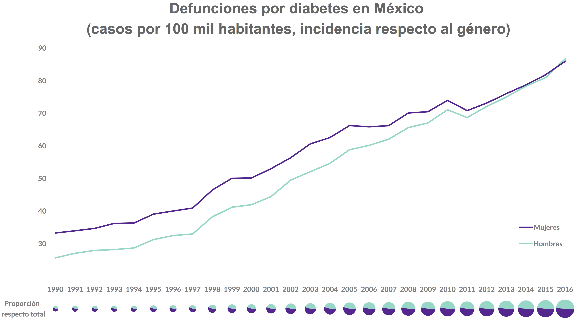

cachitos de diseño es una serie de publicaciones pequeñas celebrando o criticando (de una manera respetuosa) una decisión en el diseño de una visualización de datos. 

El gráfico en cuestión tal vez tenga más de una razón para ser celebrado pero trataré de concentrarme en una sola. Esta serie es inspirada por la serie *muy*, *muy* similar de [Andy Kirk](http://www.twitter.com/visualisingdata) en su sitio [Visualising Data](https://visualisingdata.com).

***

En esta primera edición, tomada desde el reporte [*"Diabetes: Un desafío para la Salud Pública de Precisión en México, problemática abordada desde la Ciencia de Datos"*](http://www.datalabmx.com/diabetes.html) de **[DataLabMX](datalabmx.com)**

##### Su gráfica 2A

El cachito de diseño que estamos celebrando en esta gráfica es el uso de las *facetas* que encontramos debajo de la gráfica principal.    

Al reutilizar el eje horizontal de la gráfica de líneas podemos agregar otra capa de información (en este caso la *proporción respecto al total*) sin saturar el gráfico original.

El único criticismo que podría ofrecer es que el tamaño de las facetas no *necesita* representar la cantidad total de defunciones ya que podemos observar esto en el gráfico de líneas superior de una manera más eficáz.

Estas facetas son pequeñas y no ofrecen a quien lea el reporte porcentages exactos. Esto esta completamente bien ya lo que se esta ilustrando es el cambio en las proporciones, la tendencia, no los números exactos.
Si fueran del mismo tamaño podríamos observar de manera más inmediata que casi 3 de 5 personas que fallecieron por diabetes en México en 1990 fueron mujeres.

El uso de un gráfico (o una serie de gráficos) como apoyo a un gráfico principal es algo a lo que no le debemos tener miedo. Esta serie de facetas complementan al gráfico principal y aportan otra capa de información de interés al lector.

***

Una pregunta para ustedes ¿cómo le llaman ustedes a estos gráficos circulares? los conocidos y odiados *pie charts* en inglés. Mándenme un tuit a [@ChekosWH](https://twitter.com/share?text=yo+le+digo+&url=https://tacosdedatos.com/cachitos-de-dise%C3%B1o)
