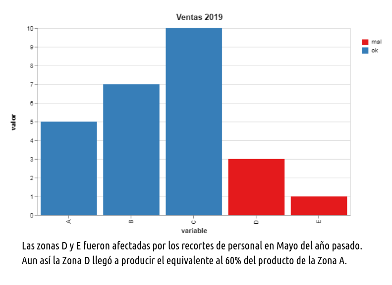

En la visualización y la ciencia de datos, como en cualquier otro ámbito técnico, la comunicación efectiva es una habilidad esencial. 

La comunicación con datos efectiva es una combinación de 1) tus habilidades ilustrativas (visualización de datos) y 2) tus habilidades narrativas. No sólo es importante mostrar tus resultados con gráficos y diagramas. Es necesario el saber narrar tus resultados. 

쯈ué hemos descubierto? 쮺칩mo llegamos a estas conclusiones? 쯇or qué deberían los demás tomar un poco de su tiempo y poner atención a tu investigación y resultados?

En **tacosdedatos** seguiremos agregando recursos para desarrollar no sólo nuestras habilidades técnicas sino también otras habilidades complementarias. En este caso, como mejorar tus habilidades narrativas - como comunicar mejor con datos. 

##### 5 consejos prácticos.

1\. **Mantén en mente el contexto y tu audiencia.** 

  Un error muy común al adentramos tanto en nuestro proyecto es olvidarnos que estamos presentando un producto final a alguien más. A alguien que no ha estado contigo paso a paso en tu análisis. Recuerda quien es tu ***audiencia***: 쯘stás presentando tus resultados al equipo de edición en tu periodico local? 쯔 tu jefe que quiere saber como van las ventas? 쯔 tus alumnos? 쯔 tus seguidores en redes sociales? (sígueme [@tacosdedatos](https://twitter.com/tacosdedatos) 游땔).
  
  Tu audiencia va a variar de proyecto a proyecto y siempre van a llevar prioridad. Tu trabajo es personalizar tus visualizaciones y narrativas a la forma más facil de diregir para tus lectores. 
  
  Recuerda el ***contexto*** de tu presentación. Tu audiencia tiene un tiempo limitado para consumir tus visualizaciones y esto depende mucho del medio de comunicación. Si vas a enviar un reporte impreso puede que tengas el lujo de crear una visualización más compleja que si estás presentando algo en una reunión de 30 minutos con diapositivas.
  
  Solo tú sabes tu **audiencia** y el **contexto** en el que vas a presentar tus visualizaciones. Aprovecha ese conocimiento y utilizalo en tu favor.
  
2\. **Escoje la mejor visualización para lo que quieres dar a conocer.**

  La mejor visualización es la que transfiere la información de la manera más eficiente. Muchas veces nos encantaría mostrar un cartograma o algún análisis de redes porque son muy, muy, **muy** interesantes y atractivos pero la realidad es que un simple gráfico de barras puede llegar ser más efectivo y eficiente. 
  
3\. **Trata de mantenerlo simple. Estas presentando resultados, no explorando datos.** 

  Sumandole a los puntos que llevamos: recordando tu audiencia y el contexto de tu presentación probablemente la mejor visualización es algo más simple de lo que crees. 
  
  Quiero compartirles un ejemplo personal. En el trabajo estabamos escribiendo un reporte sobre la población migrante en California en Estados Unidos. Yo quería hacer algo así:
  
  
  
  Obviamente primero personalizarlo con los colores de la empresa pero quería tener toda la información ahí presente. Quería que quien leyera pudiera ver las tendencias por nivel de educación y por país, que pudiera ver las proporciones por año, etc. Pero la realidad es que el punto que estabamos tratando de ilustrar es que la mayoría de los immigrantes llegando a California no vienen de Latinoamérica ya. Ahora llegan de Asia. 
  
  Mi ejemplo, técnicamente mostraba eso. Entre ***muchas*** otras cosas. Pero solamente necesitabamos illustrar **un** hecho. Un gráfico como este lograba eso:
  
  
  
4\. **Elimina distracciones y atrae atención a lo que *tú* quieres que se le ponga atención.**

  Esto va mano a mano con mantener tus visualizaciónes explicativas y simples pero no es lo mismo.
  No tengas miedo de ser obvio en tus intenciones. Tomemos por ejemplo estos dos gráficos de barras. Ambos muestran la misma información pero uno de ellos esta enfatizando un hecho muy obviamente.
  
  
  
  - No tengas miedo de agregar textos explicativos. Tus visualizaciones no siempre van a vivir en donde esperas y es buena practica incluir detalles que pueden ayudar a entender la visualización fuera de contexto (si no afecta tu visualización en sí). 
   
  
5\. **Se conciente de los colores que utilizas y se conciente de las predispociciones de tu audiencia.** 

   A nadie le gusta ver números rojos en una reunión de negocios.

***

**Narra. Cuenta la historia.**

  La visualización efectiva de datos se complementa con tu habilidad narrativa. Cuando termines tus lectores deberían poder explicarle a alguien que no estuvo presente de que se trató tu proyecto. O tu presentación. O tu artículo. Entregales el lenguaje para compartir el conocimiento que les acabas de otorgar. 

  En el mundo de los datos es fácil sentir la abrumación de tantos números, tendencias y patrones volando a todos lados. Como periodistas, como practicantes de la ciencia, como visualizadores, como escritores, como personas curiosas, es nuestro trabajo el sintetizar estos torbellinos de información en algo digerible para los demás. Para que esas personas tomen decisiones informadas. Para que construyan encima de lo que tu construiste y alcanzemos nuevas alturas como sociedad. 
  
  Cuando analizamos y visualizamos información aprendemos. Entre más aprendemos, más podemos enseñar a los demás. 

***

> *"El conocimiento os hará libres" - Socrates*

