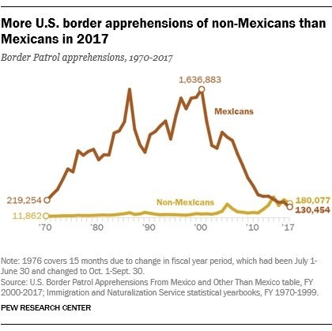

Cuando el New York Times, Pew Research Center y Bloomberg visualizan los mismos datos. Este cachito de diseño es 3 x 1. Esta semana el presidente de Estados Unidos, El-Que-No-Debe-Ser-Nombrado, dió su discurso anual: *el Estado de la Unión*.

Muchas publicaciones se dieron a la tarea de corroborar sus *"declaraciones"* por lo cual sucedió este evento poco común donde muchos investigadores y periodistas presentan la misma información pero cada quien a su manera.

<figure>
    
    <figcaption style="text-align:center"><a href="https://www.nytimes.com/interactive/2019/01/11/us/politics/trump-border-crisis-reality.html" target="_blank" rel="noopener">New York Times</a></figcaption>
</figure>

<figure>
    
    <figcaption style="text-align:center"><a href="http://www.pewresearch.org/fact-tank/2019/01/16/border-apprehensions-of-migrant-families-have-risen-substantially-so-far-in-2018/" target="_blank" rel="noopener">Pew Research Center</a></figcaption>
</figure>

<figure>
    
    <figcaption style="text-align:center"><a href="https://www.bloomberg.com/graphics/trump-mexico-wall/#how-many-people-currently-cross" target="_blank" rel="noopener">Bloomberg</a></figcaption>
</figure>

 
Los tres gráficos presentan la cantidad total de arrestos en la frontera con México pero cada una de estas instituciones tomo una decisión consciente sobre que querían enfatizar.

* El New York Times se enfoca en las administraciones en la Casa Blanca como si dijeran *"Trump dice que estamos en crisis pero miren como estaban las cosas bajo Bush."*

* Pew Research Center enfatiza el cambio en 2017, su título declara "Más arrestos en la frontera de no-mexicanos que de mexicanos en el 2017".  

* Bloomberg decidió concentrarse en la "caída en picada" de los arrestos desde el 2000. 

Cuando analizamos y visualizamos datos para presentar debemos detenernos un segundo a pensar: ¿qué punto estoy tratando de probar? ¿qué quiero resaltar? 

Del mismo conjunto de datos pueden salir muchas historias muy diferentes.

En lo personal, me gustó más el de PEW porque utilizan líneas en lugar de barras lo cual deja mucho más espacio en blanco y vuelve el gráfico *menos pesado* al leer. 

¿A ti que gráfico te gusto más? [Mandanos un tuit](https://twitter.com/share?text=Obvis+microbis+el+de+PEW+es+el+mejor+%40tacosdedatos+%F0%9F%8C%AE)
