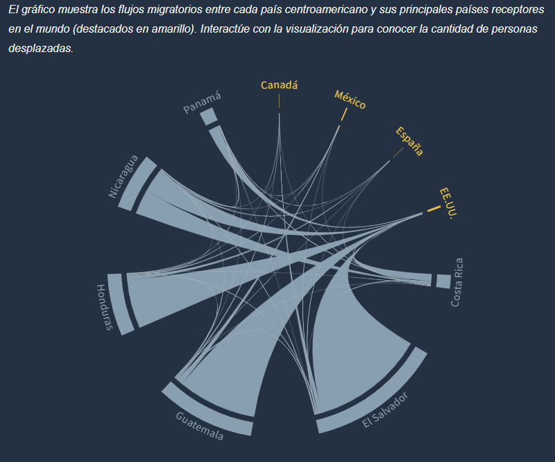
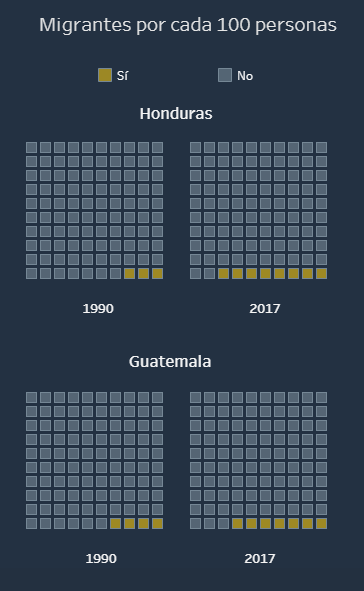

El ***periodismo de datos*** es una tarea diferente a la de científicos quienes tienen el lujo de presentar a una audiencia familiarizada con la materia. ¿Cómo presentamos información compleja a un público general? 

 
Cada día es más popular el [#ddj](https://twitter.com/search?q=%23ddj) - *Data Driven Journalism* o ***periodismo de datos***. De este campo del periodismo podemos aprender mucho quienes hemos aprendido *sólo* a presentar información técnica.

En este cachito de diseño quiero celebrar el uso de colores en la historia [*"Migrar para no morir en la violencia y la probreza"*](http://hasselfallas.com/2019/02/11/migrar-para-no-morir-en-la-violencia-y-la-pobreza/) de [Hassel Fallas](https://twitter.com/hasselfallas) de este 11 de febrero.  

La historia está escrita en letras blancas con un fondo oscuro lo cual lo hace ya un poco más fácil de leer en si. Lo que más me atrajo fue el uso de colores *llamativos* pero opacos como el amarillo y el azul claro de sus visualizaciones. 

<figure>
    
    
    <figcaption style="text-align:center"><a href="http://hasselfallas.com/2019/02/11/migrar-para-no-morir-en-la-violencia-y-la-pobreza/" target="_blank" rel="noopener">Migrar para no morir en la violencia y la pobreza, Hassel Fallas</a></figcaption>
</figure>

En esta era digital tenemos el lujo de poder controlar absolutamente todo. Desde el fondo de nuestra pantalla hasta los colores y el tamaño de cada letra. Esto es algo que debemos tener en cuenta cuando presentamos información en un medio digital. 

Esta combinación de colores me encantó porque atrae tu atención pero no de una manera brusca como lo haría un amarillo o un azul más *brillante*.

La próxima vez que publiques una visualización ten en mente que un fondo blanco es opcional. Tú tienes la habilidad de controlar los colores de la visualización que estas creando y de el medio en el que la estás presentando.

Para terminar, si encuentras una visualización que te haya gustado mucho ¡compartela con nosotros! [Mandanos un tuit a @tacosdedatos](https://twitter.com/share?text=Miren+lo+que+encontre+%40tacosdedatos+%F0%9F%8C%AE) o envianos un correo a [✉️ sugerencias@tacosdedatos.com](mailto:sugerencias@tacosdedatos.com?subject=Sugerencia&body=Hola-holaaa). 