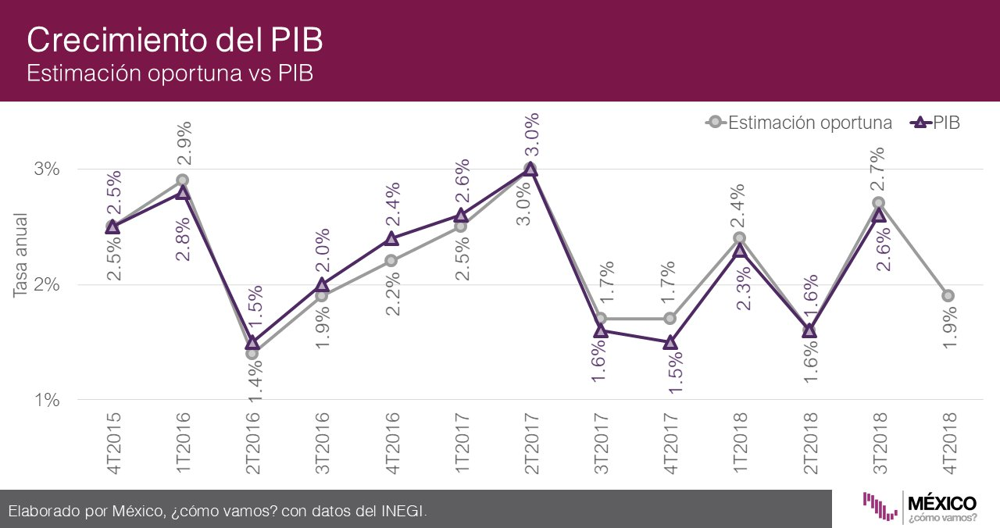

Cuando tenemos un espacio pequeño para visualizar nuestros datos, como es el caso en las redes sociales, es importante utilizarlo de manera eficiente. Mantén en mente la famosa _proporción de tinta y datos_ de Edward Tufte. 

<figure>
    
    <figcaption style="text-align:center"><a href="https://twitter.com/MexicoComoVamos/status/1093211471738257408" target="_blank" rel="noopener"><i>México ¿Cómo Vamos?</i></a></figcaption>
</figure>

Esta figura aparece en la cuenta de twitter de _México ¿Cómo Vamos?_: 
> México, ¿Cómo Vamos? es un colectivo de investigadores integrado por un grupo plural de académicos y expertos en economía y política pública mexicana. 

En este cachito nos vamos a concentrar en el uso de etiquetas del gráfico. Especificamente en el eje horizontal.

El eje horizontal tiene 13 puntos: 4 trimestres de los años 2016 a 2018 y el último trimestre de 2015. Estos son representados con la combinación ***4T2017*** por ejemplo. ***4T*** representando el 4º trimestre y ***2017*** el año correspondiente. 

El cachito de diseño es sobre la *redundancia* de nuestras etiquetas. Cuando existen patrones claros y predecibles en nuestros datos no es necesario mencionarlos explícitamente. Una alternativa a escribir 13 etiquetas de 6 caracteres podría ser escribir una sola vez el año y repetir el patrón *** 2T 3T 4T *** para representar los trimestres entre cada uno.

Por ejemplo,
<figure>
    
    <figcaption style="text-align:center"><i>México ¿Cómo Vamos? (Remix)</i></figcaption>
</figure>

Como hemos visto en otros [cachitos](https://tacosdedatos.com/tag/cachitos/) siempre tenemos que tener en mente el medio en el que presentamos nuestros graficos. En twitter la proporción _ideal_ para que una foto aparezca completa en la línea de tiempo de tus seguidores es de 1.91:1 y esto significa que no tienes mucho espacio vertical. Al tener nuestras etiquetas de manera vertical en un medio como twitter puede que estemos utilizando más espacio del absolutamente necesario. 

Pero ¿qué sucede cuando nuestras etiquetas son demasiado largas como para escribirlas de manera horizontal? (i.e. *4T2017*)  
La mayoría de las veces una etiqueta larga es una etiqueta redundante. Especialmente en nuestros ejes. Las etiquetas de nuestros ejes funcionan referencía no como fuentes principales de información. 

Si vas a publicar una visualización en alguna red social ten en mente las dimensiones ideales para la plataforma ¡y aprovechalas al máximo!

Para terminar, si encuentras una visualización que te haya gustado mucho ¡compartela con nosotros! [Mandanos un tuit a @tacosdedatos](https://twitter.com/share?text=Miren+lo+que+encontre+%40tacosdedatos+%F0%9F%8C%AE) o envianos un correo a [✉️ sugerencias@tacosdedatos.com](mailto:sugerencias@tacosdedatos.com?subject=Sugerencia&body=Hola-holaaa). Y si recuerda que puedes subscribirte a nuestro boletín aquí debajo. Cada semana (o dos) te enviamos enviamos nuestras publicaciones y las últimas noticias directamente a tu caja de entrada.
