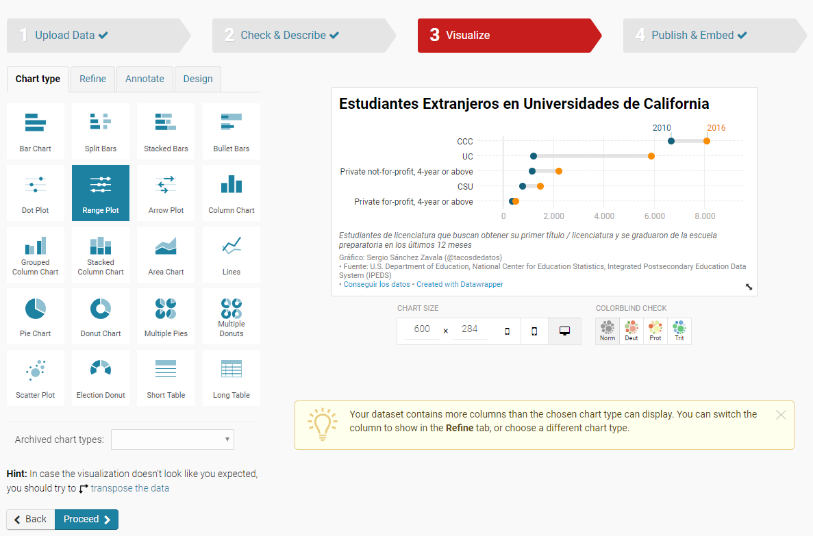
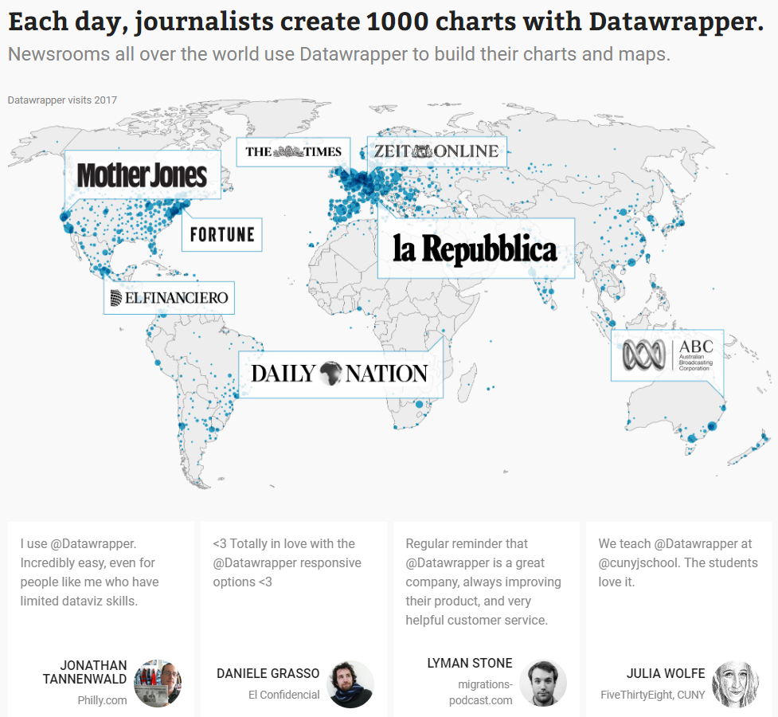

Datawrapper es una herramienta de visualización de datos _"por periodistas, para periodistas"_. No necesitas saber programar o de diseño para crear visualizaciones atractivas e interactivas en cuestión de minutos. 

En esta publicación del blog quiero compartirles esta poderosa herramienta. 
<figure>
<iframe title="Gráfico: Estudiantes Extranjeros en Universidades de California" aria-describedby="" id="datawrapper-chart-SrMxE" src="//datawrapper.dwcdn.net/SrMxE/1/" scrolling="no" frameborder="0" style="width: 0; min-width: 100% !important;" height="284"></iframe>
<figcaption style="text-align:center">Este gráfico fué creado con **Datawrapper** en 10 minutos.</figcaption>
</figure>
Existen muchas herramientas hoy en día para visualizar tus datos sin necesidad de escribir una sola línea de código. En **tacosdedatos** planeamos compartir un pequeño resumen de cada una con sus ventajas y desventajas. Esta publicación es la primera de la serie.

## Ventajas de Datawrapper
  - Datawrapper asume cero conocimiento de diseño o programación de tu parte. 
    Para trabajar en Datawrapper sólo necesitas tus datos y ya. Datawrapper se encarga hasta de escoger una paleta de colores inclusiva.  
   <figure>
    
    <figcaption style="text-align:center"><i><a href='https://datawrapper.de/'>Datawrapper</a></i></figcaption>
   </figure> 
    Si decides escoger tus colores manualmente Datawrapper te hará saber si tu combinación será difícil de ver para algunas personas con daltonismo.

  - Una interfáz intuitiva. 
    Aunque su sitio es en inglés también es muy intuitivo y utilizan íconos para todo. No necesitar saber hablar o leer inglés para utilizar su servicio.

  - Todo es en tu navegador
    Datawrapper existe completamente en tu navegador sin la necesidad de descargar ninguna aplicación de software. Esto significa puedes utilizarlo aun si trabajas en una oficina donde no tengas privilegios de administrador para instalar aplicaciones en tu computadora. No se ustedes pero yo no puedo instalar nada sin tener que convencer a 3 personas de que es **indispensable** que me pongan el programa que estoy pidiendo (lo que lo hace más difícil es que la mayoría de las veces no es indispensable 😜) 

## Desventajas
  - Lo que ves es lo que hay.
    Datawrapper es **muy** bueno para visualizar datos en los gráficos que tienen. Pero sólo en los gráficos que tienen. Es una selección amplia pero si lo que quieres es una herramienta para crear visualizaciones súper personalizadas, esta no es la indicada.
  - Tienes que limpiar tus datos antes de subirlos a Datawrapper.
    Datawrapper acepta archivos en formato `.csv` y excel además de Google Sheets. Pero no puedes manipular tus datos _en_ Datawrapper como lo podrías hacer en Tableau, por ejemplo. Esto es porque 1) Datawrapper vive en tu navegador y no es una aplicación como Tableau, y 2) porque Datawrapper es para visualizar datos, no para analizarlos. 

***
Si visitan [Datawrapper](https://datawrapper.de) podrán ver que grandes instituciones periodisticas lo utilizan actualmente. 
   <figure>
    
    <figcaption style="text-align:center"><i><a href='https://datawrapper.de/'>Datawrapper</a></i></figcaption>
   </figure> 

