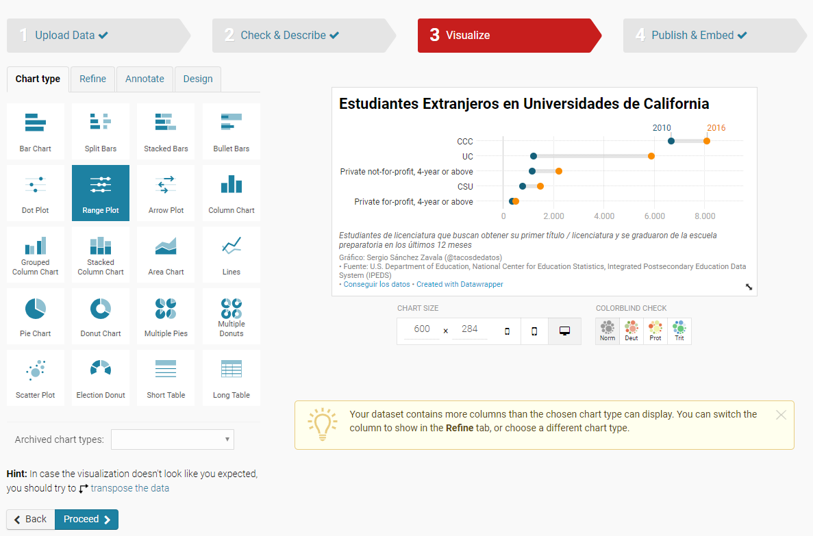

Datawrapper es una herramienta de visualización de datos _"por periodistas, para periodistas"_. No necesitas saber programar o de diseño para crear visualizaciones atractivas e interactivas en cuestión de minutos. 

En esta publicación del blog quiero compartirles esta poderosa herramienta. 
<figure>
<iframe title="Gráfico: Estudiantes Extranjeros en Universidades de California" aria-describedby="" id="datawrapper-chart-SrMxE" src="//datawrapper.dwcdn.net/SrMxE/2/" scrolling="no" frameborder="0" style="width: 0; min-width: 100% !important;" height="284"></iframe>
<figcaption style="text-align:center">Este gráfico fué creado con <i><a href='https://datawrapper.de/'>Datawrapper</a></i> <strong>en 10 minutos.</strong></figcaption>
</figure> 
Existen muchas herramientas hoy en día para visualizar tus datos sin necesidad de escribir una sola línea de código. En **tacosdedatos** planeamos compartir un pequeño resumen de cada una con sus ventajas y desventajas. Esta publicación es la primera de la serie.

## 쯈ué es Datawrapper?
> Datawrapper es una herramienta creada por un equipo de once personas.
> Trabajamos juntos para crear la mejor herramienta de gráficos para todos los que quieran mostrar sus datos en hermosos gráficos y mapas.
Esta herramienta para visualización de datos existe completamente en tu navegador (en [datawrapper.de](https://datawrapper.de/)) donde puedes construir gráficos elegantes, interactivos y, lo más importante, sin necesidad de saber programar.

## Ventajas de Datawrapper
  - Datawrapper asume cero conocimiento de diseño o programación de tu parte.  
    Para trabajar con Datawrapper sólo necesitas tus datos y ya. Datawrapper se encarga hasta de escoger una paleta de colores inclusiva.  
   <figure>
    
    <figcaption style="text-align:center"><i><a href='https://datawrapper.de/'>Datawrapper</a></i></figcaption>
   </figure> 
    Si decides escoger tus colores manualmente Datawrapper te hará saber si tu combinación será difícil de ver para personas con daltonismo.

  - Una interfáz intuitiva.  
    Aunque su sitio es en inglés también es muy intuitivo y utilizan íconos para todo. No necesitas saber hablar o leer inglés para utilizar su servicio.

  - Todo es en tu navegador  
    Datawrapper existe completamente en tu navegador sin la necesidad de descargar ninguna aplicación de software. Esto significa puedes utilizarlo aún si trabajas en una oficina donde no tengas privilegios de administrador para instalar aplicaciones en tu computadora. No sé ustedes pero yo no puedo instalar nada sin tener que convencer a 3 personas de que es **indispensable** que me pongan el programa que estoy pidiendo (lo que lo hace más difícil es que la mayoría de las veces no es indispensable 😜) 

## Desventajas
  - Lo que ves es lo que hay.  
    Datawrapper es **muy** bueno para visualizar datos en los gráficos que tienen. Pero sólo en los gráficos que tienen. Es una selección amplia pero si lo que quieres es una herramienta para crear visualizaciones súper personalizadas, esta no es la indicada. 

  - Tienes que limpiar tus datos antes de subirlos a Datawrapper.  
    Datawrapper acepta archivos en formato `.csv` y excel además de Google Sheets. Pero no puedes manipular tus datos _en_ Datawrapper como lo podrías hacer en Tableau, por ejemplo. Esto es porque 1) Datawrapper vive en tu navegador y no es una aplicación como Tableau, y 2) porque Datawrapper es para visualizar datos, no para analizarlos. 

***

La visualización de datos no tiene que ser sinónimo de saber programar. Si nunca en tu vida has visto una terminal o escrito un `¡Hola mundo!` aún puedes visualizar datos de una manera elegante y eficáz. Datawrapper es una de las muchas herramientas con la que lo puedes lograr. 

Si visitas [Datawrapper](https://datawrapper.de) podrás ver que grandes instituciones periodisticas lo utilizan actualmente. 
   <figure>
    
    <figcaption style="text-align:center"><i><a href='https://datawrapper.de/'>Datawrapper</a></i></figcaption>
   </figure> 

Para terminar te quiero compartir 3 puntos más relacionados a Datawrapper la empresa, no la herramienta:
1. Su blog semanal maravilloso llamado [**Chartable**](https://blog.datawrapper.de). 
2. Su sección _académica_ donde puedes aprender a crear todos los gráficos que ofrecen. Son tutoriales muy detallados y útiles. [**Datawrapper Academy**](https://academy.datawrapper.de)
3. Su [**River**](https://river.datawrapper.de/), un _río_ de visualizaciones del que puedes tomar gráficos y sus datos y modificarlos a tu gusto. 

*** 
Este es el primer blog de la serie sobre herramientas para visualizar datos sin programación. Queremos mantenerlos cortos y directos al punto, listando ventajas y desventajas y uno que otro punto relevante. Creemos que aprendemos más y mejor explorando, lo que queremos hacer en **tacosdedatos** es señalarte a donde ir.  
쯈ué te pareció el formato? 쯊e gustarían resúmenes más detallados o crees que así esta bien? [Mandanos un tuit a @tacosdedatos](https://twitter.com/share?text=Obvio+que+estuvo+super+el+blog+%40tacosdedatos+%F0%9F%8C%AE) o envianos un correo a [九괦잺 sugerencias@tacosdedatos.com](mailto:sugerencias@tacosdedatos.com?subject=Sugerencia&body=Hola-holaaa). Y recuerda que puedes subscribirte a nuestro boletín aquí debajo. Cada semana (o dos) te enviamos enviamos nuestras publicaciones y las últimas noticias directamente a tu caja de entrada.