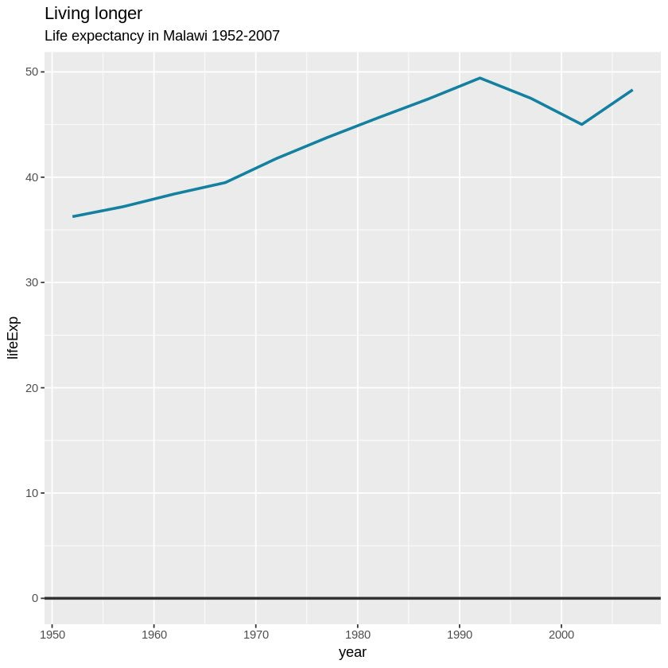
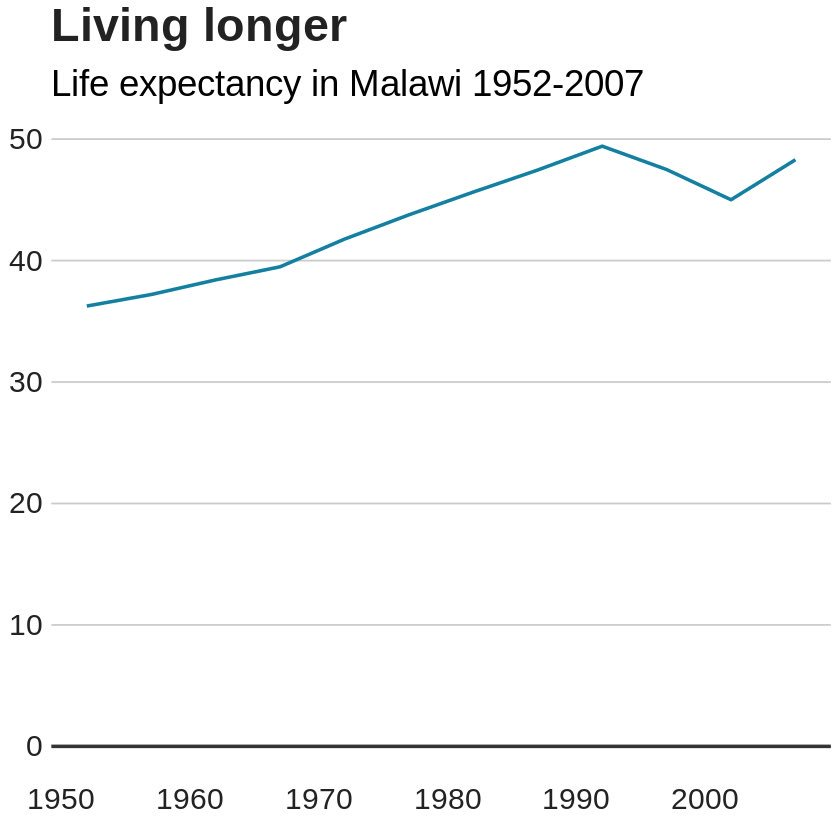

<!-- Load Thebelab for interactive widgets -->




`ggplot2` es un paquete del lenguage `R` para la visualizacion de datos. El par de **G**s en `ggplot2` es de *Grammar of Graphics* o la ***Gramatica de Graficos*** - una lenguaje simple e intuitivo para *construir* á. 

> Una gramática de gráficos es una herramienta que nos permite describir de manera concisa los componentes de un gráfico. Dicha gramática nos permite ir más allá de los gráficos con nombre (por ejemplo, el _gráfico de dispersión_) y obtener información sobre la estructura profunda que subyace en los gráficos estadísticos.   - **_Hadley Wickham_**, creador del `tidyverse` en `R` en su arículo _A Layered Grammar of Graphics (2010)

### ¿Qué es `bbplot`?
A finales de enero del 2019, la BBC publicó el paquete [`bbplot`](https://github.com/bbc/bbplot) y un [*libro de recetas*](https://bbc.github.io/r-cookbook) para crear varios á listos para publicacion con `ggplot2`.  

> La meta es crear un proceso de creacion de á con su estilo personalizado más reproducible y de paso ayudarle a principiantes de `R` a hacer gráficos. 

`bbplot` es un paquete que transforma un gráfico creado con `ggplot2` agregandole el _estilo_ de la BBC.

<figure>
    
    <figcaption style="text-align:center"><i>Ejemplos de gráficos con el estilo de la BBC</i></figcaption>
</figure>
 

`bbplot` es esencialmente dos funciones:
* `bbc_style()`: agrega atributos a tu gráfico de `ggplot2`. Lo único que necesitas hacer es agregar la linea `+ bbc_style()` a tu gráfico de `ggplot2` para transformarlo en algo que pareciera haber salido de un articulo de la BBC.
<figure>
     
    <figcaption style="text-align:center"><i>La diferencia entre estos dos gráficos es `+ bbc_style()`</i></figcaption>
</figure>
 

* `finalise_plot()`: agrega los ultimos detalles a tu gráfico y lo guarda como image `.png`. Esto esencialmente alinea a la izquierda el titulo y el subtitulo de tu gráfico además de agregar una nota al pie con la fuente de tus datos y hasta un logo si así lo deseas.

***

La meta de este artículo es ilustrar lo que puedes hacer con el paquete `bbplot`

## Ejemplos
Sin más preambulo veamos `bbplot` en acción. En **tacosdedatos** acabamos de agregar una magia antigüa para poder hacer nuestros artículos más interactivos 🔮👀 (se llama [thebelab](https://thebelab.readthedocs.io/)).  
Si vas al inicio de esta pagina veras el botón *✨ activar código ✨*. Al hacer clic transformarás las celdas de código aquí debajo en celdas ejecutables. Estas celdas *activadas* son editables así que te invito a que cambies el código para personalizar los á un poco como se te ocurra. Detrás de todo esto esta el poder de [MyBinder](https://mybinder.org/) un proyecto del mismo equipo que te trajo `Project Jupyter` del cual aprenderemos más adelante. 

### Primero necesitas cargar los paquetes necesarios
En el *libro de recetas* publicado en conjunto con `bbplot` la BBC sugiere utilizar el paquete `pacman` para cargar los paquetes necesarios a tu entorno. Esto es el equivalente de escribir `library("dplyr")`, `library("tidyr")`, `library("gapminder")`, etc.  
*NOTA: La primera linea del código instala `pacman` si no lo tienes.*
<pre data-executable="true" data-language="R">
<code class = 'language-r'>if(!require(pacman))install.packages("pacman")

pacman::p_load('dplyr', 'tidyr', 'gapminder',
               'ggplot2',  'ggalt',
               'forcats', 'R.utils', 'png', 
               'grid', 'ggpubr', 'scales',
               'bbplot')
</code></pre>

***

**Mucho ojo**, nosotros ya tenemos instalado el paquete `bbplot`. Si no lo haz instalado el código aquí arriba resultará en un error. 
`bbplot` no está en [`CRAN`](https://cran.r-project.org/), el sistema central de paquetes de `R` del que normalmente descargarías un paquete nuevo.  
A `bbplot` lo instalas desde *GitHub* con `devtools`. Esto puede ser un poco confuso para los principiantes ya que en esencia son dos pasos *aunque con todos los que hable en preparación para este articulo me lo contaron como si fuera algo simple y sencillo...* 🙄

Paso 1: instala `devtools`, el paquete que te ayuda a instalar paquetes de *GitHub*. Este si existe en `CRAN` así que solo necesitas ejecutar:
<pre><code class = "language-r">install.packages("devtools")</code></pre>
Paso 2: instala `bbplot` utilizando `devtools`:
<pre><code class = 'language-r'>devtools::install_github("bbc/bbplot")</code></pre>

**Mucho ojo (parte 2)**, existe un sinfín de razones por las cuales esto no funcione en ciertos sistemas. Por ejemplo, el servidor conectado a esta página donde estas ejecutando código está basado en `Linux` (Ubuntu 16.04, creo) y por alguna razón no podíamos instalarlo con `devtools`. Lo que tuvimos que hacer es clonar el repositorio `bbc/bbplot`, instalarlo como **source** y luego borramos los archivos de donde estabamos trabajando ya que no los necesitamos más. 

<pre><code class='language-shell'>git clone https://github.com/bbc/bbplot.git
R --quiet -e "install.packages('bbplot', repos = NULL, type = 'source')"
rm -rf bbplot # en sistemas linux/macOS 'rmdir /s /q bbplot' en Windows</code></pre>

***

Ya que tenemos todos los paquetes instalados y cargados en tu entorno podemos hacer nuestros gráficos. Utilizaremos los datos de `Gapminder` los cuales puedes instalar también de `CRAN`. [`Gapminder`](https://gapminder.org/) *"es una fundación sueca sin afiliaciones políticas, religiosas o económicas que busca luchar contra los conceptos erróneos y devastadores sobre el desarrollo global"* a través de datos.

<pre data-executable="true" data-language="R">
<code class = 'language-r'># Datos de gapminder
datos_para_linea <- gapminder %>%
  filter(country == "Colombia") 

# crea el gráfico
linea <- ggplot(datos_para_linea, aes(x = year, y = lifeExp)) 
  + geom_line(colour = "#1380A1", size = 1) 
  + geom_hline(yintercept = 0, size = 1, colour="#333333") 
  + labs(title="Pura Vida", 
         subtitle = "Esperanza de Vida en Colombia 1952-2007")
  + bbc_style()

# muestra el gráfico
linea
</code></pre>

***

Pero vayamos paso a paso.  
Paso 1: Crea un gráfico y asignale lo que `ggplot2` llama *aesthethic mappings* o mapeos estéticos (cuando *mapeas* o relacionas tus datos a una característica estética del gráfico).  
Es decir: *X es el año e Y es esperanza de vida*. 
<pre data-executable="true" data-language="R">
<code class = 'language-r'># Ya tenemos cargados los datos
# crea el gráfico - paso 1
linea <- ggplot(datos_para_linea, aes(x = year, y = lifeExp))

# muestra el gráfico
linea
</code></pre>

Paso 2: Agregale una *geometría*. ¿Cómo vas a visualizar los valores *mapeados*? En este caso con una línea:
<pre data-executable="true" data-language="R">
<code class = 'language-r'># Ya tenemos cargados los datos
# crea el gráfico - paso 2
linea <- ggplot(datos_para_linea, aes(x = year, y = lifeExp))
  + geom_line(colour = "#1380A1", size = 1)

# muestra el gráfico
linea
</code></pre>

Paso 3: Agregamos una línea horizontal `geom_hline` en el valor 0 de `Y`. Este paso es opcional pero recomendado - `Y` representa Esperanza de Vida y estaría bueno que tu escala comience en 0.
<pre data-executable="true" data-language="R">
<code class = 'language-r'># Ya tenemos cargados los datos
# crea el gráfico - paso 3
linea <- ggplot(datos_para_linea, aes(x = year, y = lifeExp)) 
  + geom_line(colour = "#1380A1", size = 1) 
  + geom_hline(yintercept = 0, size = 1, colour="#333333")

# muestra el gráfico
linea
</code></pre>

Paso 4: Güau que rápido vas. En este paso le agregamos `labels` o etiquetas: Título y Subtítutlo. 
<pre data-executable="true" data-language="R">
<code class = 'language-r'># Ya tenemos cargados los datos
# crea el gráfico - paso 4
linea <- ggplot(datos_para_linea, aes(x = year, y = lifeExp)) 
  + geom_line(colour = "#1380A1", size = 1) 
  + geom_hline(yintercept = 0, size = 1, colour="#333333") 
  + labs(title="Pura Vida", 
         subtitle = "Esperanza de Vida en Colombia 1952-2007")

# muestra el gráfico
linea
</code></pre>

Paso 5: Agrégale `+ bbc_style()` y ¡ya quedó!
<pre data-executable="true" data-language="R">
<code class = 'language-r'># Ya tenemos cargados los datos
# crea el gráfico - paso 5
linea <- ggplot(datos_para_linea, aes(x = year, y = lifeExp)) 
  + geom_line(colour = "#1380A1", size = 1) 
  + geom_hline(yintercept = 0, size = 1, colour="#333333") 
  + labs(title="Pura Vida", 
         subtitle = "Esperanza de Vida en Colombia 1952-2007") 
  + bbc_style()
  
# muestra el gráfico
linea
</code></pre>

## MáS EJEMPLOS

<pre data-executable="true" data-language="R">
<code class = 'language-r'>
library("ggalt")
library("tidyr")

#Prepare data
dumbbell_df <- gapminder %>%
  filter(year == 1967 | year == 2007) %>%
  select(country, year, lifeExp) %>%
  spread(year, lifeExp) %>%
  mutate(gap = `2007` - `1967`) %>%
  arrange(desc(gap)) %>%
  head(10)

#Make plot
ggplot(dumbbell_df, aes(x = `1967`, xend = `2007`, y = reorder(country, gap), group = country)) + 
  geom_dumbbell(colour = "#dddddd",
                size = 3,
                colour_x = "#FAAB18",
                colour_xend = "#1380A1") +
  bbc_style() + 
  labs(title="We're living longer",
       subtitle="Biggest life expectancy rise, 1967-2007")
</code></pre>

<pre data-executable="true" data-language="R">
<code class = 'language-r'>
#Prepare data
facet <- gapminder %>%
  filter(continent != "Americas") %>%
  group_by(continent, year) %>%
  summarise(pop = sum(as.numeric(pop)))

#Make plot
facet_plot <- ggplot() +
  geom_area(data = facet, aes(x = year, y = pop, fill = continent)) +
  scale_fill_manual(values = c("#FAAB18", "#1380A1","#990000", "#588300")) + 
  facet_wrap( ~ continent, ncol = 5) + 
  scale_y_continuous(breaks = c(0, 2000000000, 4000000000),
                     labels = c(0, "2bn", "4bn")) +
  bbc_style() +
  geom_hline(yintercept = 0, size = 1, colour = "#333333") +
  theme(legend.position = "none",
        axis.text.x = element_blank()) +
  labs(title = "Asia's rapid growth",
       subtitle = "Population growth by continent, 1952-2007")

facet_plot
</code></pre>

<pre data-executable="true" data-language="R">
<code class = 'language-r'>
#Make plot
facet_plot_free <- ggplot() +
  geom_area(data = facet, aes(x = year, y = pop, fill = continent)) +
  facet_wrap(~ continent, scales = "free") + 
  bbc_style() +
  scale_fill_manual(values = c("#FAAB18", "#1380A1","#990000", "#588300")) +
  geom_hline(yintercept = 0, size = 1, colour = "#333333") +
  theme(legend.position = "none",
        axis.text.x = element_blank(),
        axis.text.y = element_blank()) +
  labs(title = "It's all relative",
       subtitle = "Relative population growth by continent,1952-2007")

facet_plot_free
</code></pre>
