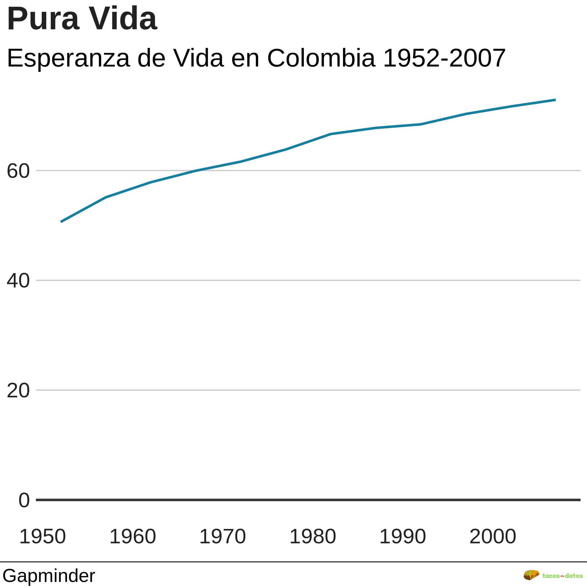
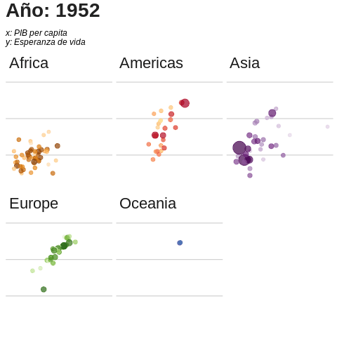

<!-- Load Thebelab for interactive widgets -->




`ggplot2` es un paquete del lenguage `R` para la visualización de datos. El par de **G**s en `ggplot2` es de *Grammar of Graphics* o la ***Gramática de Gráficos*** - un lenguaje simple e intuitivo para *construir* gráficos. 

> Una gramática de gráficos es una herramienta que nos permite describir de manera concisa los componentes de un gráfico. Dicha gramática nos permite ir más allá de los gráficos con nombre (por ejemplo, el **gráfico de dispersión**) y obtener información sobre la estructura profunda que subyace en los gráficos estadísticos.   - **_Hadley Wickham_**, creador del `tidyverse` en `R` en su arículo **A Layered Grammar of Graphics (2010)**.

### ¿Qué es `bbplot`?
A finales de enero del 2019, la BBC publicó el paquete [`bbplot`](https://github.com/bbc/bbplot) y un [*libro de recetas*](https://bbc.github.io/r-cookbook) para crear varios gráficos listos para publicación con `ggplot2`.  

> La meta es crear un proceso de creación de gráficos más reproducible y de paso ayudarle a principiantes de `R` a hacer gráficos. 

`bbplot` es un paquete que transforma un gráfico creado con `ggplot2` agregándole el _estilo_ de la BBC.
<figure>
    
    <figcaption style="text-align:center"><i>Ejemplos de gráficos con el estilo de la BBC</i></figcaption>
</figure> 

`bbplot` es esencialmente dos funciones:
* `bbc_style()`: añade atributos a tu gráfico de `ggplot2`.  
Lo único que necesitas hacer es agregar la línea `+ bbc_style()` a tu gráfico de `ggplot2` para transformarlo en algo que pareciera haber salido de un artículo de la BBC.
<figure>
    

        

          
        

        

          
        

    

    <figcaption style="text-align:center"><i>La diferencia entre estos dos gráficos es </i>+ bbc_style()</figcaption>
</figure> 

* `finalise_plot()`: agrega los ultimos detalles a tu gráfico y lo guarda como imagen `.png`. Esto esencialmente alínea a la izquierda el título y el subtítulo de tu gráfico además de agregar una nota al pie con la fuente de tus datos y hasta un logo si así lo deseas.
<figure>
    
    <figcaption style="text-align:center"><i>Un gráfico finalizado con todo y el logo de <strong>tacosdedatos</strong></i></figcaption>
</figure>

***

### La meta de este artículo es ilustrar lo que puedes hacer con el paquete `bbplot`
Sin más preambulo veamos `bbplot` en acción. En **tacosdedatos** acabamos de agregar una magia antigüa para poder hacer nuestros artículos más interactivos 🔮👀 (se llama [thebelab](https://thebelab.readthedocs.io/)).  
Si vas al inicio de esta página verás el botón *✨ activar código ✨*. Al hacer clic transformarás ciertas celdas de código aquí debajo en celdas ejecutables. Estas celdas *activadas* son editables así que te invito a que cambies el código para personalizar los gráficos un poco como se te ocurra. Detrás de todo esto esta el poder de [MyBinder](https://mybinder.org/) un proyecto del mismo equipo que te trajo [Project Jupyter](https://jupyter.org/) del cual aprenderemos más adelante. 

### Primero necesitas cargar los paquetes necesarios
En el *libro de recetas* publicado en conjunto con `bbplot` la BBC sugiere utilizar el paquete `pacman` para cargar los paquetes necesarios a tu entorno. Esto es el equivalente de escribir `library("dplyr")`, `library("tidyr")`, `library("gapminder")`, etc. pero en un solo comando.  
*NOTA: La primera línea del código instala `pacman` si no lo tienes.*
<pre data-executable="true" data-language="R">
<code class = 'language-r'>if(!require(pacman))install.packages("pacman")

pacman::p_load('dplyr', 'tidyr', 'gapminder',
               'ggplot2',  'ggalt',
               'forcats', 'R.utils', 'png', 
               'grid', 'ggpubr', 'scales',
               'bbplot')
</code></pre>
***
**Mucho ojo**, nosotros ya tenemos instalado el paquete `bbplot`. Si no lo haz instalado el código aquí arriba resultará en un error. 
`bbplot` no está en [`CRAN`](https://cran.r-project.org/), el sistema central de paquetes de `R` del que normalmente descargarías un paquete nuevo.  
A `bbplot` lo instalas desde *GitHub* con `devtools`. Esto puede ser un poco confuso para los principiantes ya que en esencia son dos pasos (*aunque con todos los que hablé en preparación para este artículo me lo contaron como si fuera algo simple y sencillo...* 🙄).

**Paso 1**: instala `devtools`, el paquete que te ayuda a instalar paquetes de *GitHub*. Este si existe en `CRAN` así que solo necesitas ejecutar:
<pre><code class = "language-r">install.packages("devtools")</code></pre>
**Paso 2**: instala `bbplot` utilizando `devtools`:
<pre><code class = 'language-r'>devtools::install_github("bbc/bbplot")</code></pre>

**Mucho ojo (parte 2)**, existe un sinfín de razones por las cuales esto no funcione en ciertos sistemas. Por ejemplo, el servidor conectado a esta página donde estás ejecutando código está basado en `Linux` (Ubuntu 16.04, creo) y por alguna razón no podíamos instalarlo con `devtools`. Lo que tuvimos que hacer es clonar el repositorio `bbc/bbplot`, instalarlo como **source** y luego borramos los archivos de donde estabamos trabajando ya que no los necesitamos más. 

<pre><code class='language-shell'>#clona el repositorio. ocupas tener git instalado.
git clone https://github.com/bbc/bbplot.git
# dile a R que instale el paquete
R --quiet -e "install.packages('bbplot', repos = NULL, type = 'source')"
# borra la carpeta de tu area de trabajo
## En sistemas Linux/MacOS
rm -rf bbplot #'rmdir /s /q bbplot' en Windows</code></pre>
***
Ya que tenemos todos los paquetes instalados y cargados en nuestro entorno podemos hacer nuestros gráficos. Utilizaremos los datos de `Gapminder` los cuales puedes instalar también de `CRAN`.  
[Gapminder](https://gapminder.org/) *"es una fundación sueca sin afiliaciones políticas, religiosas o económicas que busca luchar contra los conceptos erróneos y devastadores sobre el desarrollo global"* a través de datos. 
***nota: todo esto asume que ya fuiste al inicio de la página a activar el código 👀 y ejecutaste la celda que carga los paquetes con `pacman`***
<pre data-executable="true" data-language="R">
<code class = 'language-r'># Datos de gapminder
# Primero escoge un pais del conjunto de datos
# nota: Los datos de gapminder se encuentran en ingles
pais = "Colombia"
datos_para_linea <- gapminder %>%
  filter(country == pais) 

# crea el gráfico
línea <- ggplot(datos_para_linea, aes(x = year, y = lifeExp)) + 
  geom_line(colour = "#1380A1", size = 1) + 
  geom_hline(yintercept = 0, size = 1, colour="#333333") + 
  labs(title="Pura Vida", 
         subtitle = paste("Esperanza de Vida en ", pais, " 1952-2007")) + 
  bbc_style()

# muestra el gráfico
línea
</code></pre>
***
Pero vayamos paso a paso.  
**Paso 0**: Cargas tus datos.
<pre data-executable="true" data-language="R">
<code class = 'language-r'># Datos de gapminder
# Primero escoge un pais del conjunto de datos
# nota: Los datos de gapminder se encuentran en ingles
# Arabia Saudita sería 'Saudi Arabia', por ejemplo.
pais = "Colombia"
datos_para_linea <- gapminder %>%
  filter(country == pais)
</code></pre>

**Paso 1**: Crea un gráfico y asígnale lo que `ggplot2` llama *aesthethic mappings* o mapeos estéticos (cuando *mapeas* o relacionas tus datos a una característica estética del gráfico).  
Es decir: *X es el año e Y es esperanza de vida*. 
<pre data-executable="true" data-language="R">
<code class = 'language-r'># Ya tenemos cargados los datos
# crea el gráfico - paso 1
línea <- ggplot(datos_para_linea, aes(x = year, y = lifeExp))

# muestra el gráfico
línea
</code></pre>

**Paso 2**: Agrégale una *geometría*. ¿Cómo vas a visualizar los valores *mapeados*?  
En este caso con una línea:
<pre data-executable="true" data-language="R">
<code class = 'language-r'># Ya tenemos cargados los datos
# crea el gráfico - paso 2
línea <- ggplot(datos_para_linea, aes(x = year, y = lifeExp)) + 
  geom_line(colour = "#1380A1", size = 1)

# muestra el gráfico
línea
</code></pre>

**Paso 3**: Agregamos una línea horizontal `geom_hline` en el valor 0 de `Y`.  
Este paso es opcional pero recomendado - `Y` representa Esperanza de Vida y estaría bueno que tu escala comience en 0.
<pre data-executable="true" data-language="R">
<code class = 'language-r'># Ya tenemos cargados los datos
# crea el gráfico - paso 3
línea <- ggplot(datos_para_linea, aes(x = year, y = lifeExp)) + 
  geom_line(colour = "#1380A1", size = 1) + 
  geom_hline(yintercept = 0, size = 1, colour="#333333")

# muestra el gráfico
línea
</code></pre>

**Paso 4**: Güau que rápido vas. En este paso le agregamos `labels` o etiquetas: Título y Subtítutlo. 
<pre data-executable="true" data-language="R">
<code class = 'language-r'># Ya tenemos cargados los datos
# crea el gráfico - paso 4
línea <- ggplot(datos_para_linea, aes(x = year, y = lifeExp)) + 
  geom_line(colour = "#1380A1", size = 1) + 
  geom_hline(yintercept = 0, size = 1, colour="#333333") + 
  labs(title="Pura Vida", 
       subtitle = "Esperanza de Vida en Colombia 1952-2007")

# muestra el gráfico
línea
</code></pre>

**Paso 5**: Agrégale `+ bbc_style()` y ¡ya quedó!
<pre data-executable="true" data-language="R">
<code class = 'language-r'># Ya tenemos cargados los datos
# crea el gráfico - paso 5
línea <- ggplot(datos_para_linea, aes(x = year, y = lifeExp)) + 
  geom_line(colour = "#1380A1", size = 1) + 
  geom_hline(yintercept = 0, size = 1, colour="#333333") + 
  labs(title="Pura Vida", 
       subtitle = "Esperanza de Vida en Colombia 1952-2007") + 
  bbc_style()

# muestra el gráfico
línea
</code></pre>

Como puedes ver, `bbplot` es un paquete útil y muy fácil de usar. Te sirve para ahorrar tiempo en modificar cada uno de los aspectos de tu gráfico al darte un conjunto de atributos predeterminados (el estilo de la BBC). La segunda función de `bbplot` sirve para guardar tus gráficos en formato `.png`. Al inicio de este artículo vimos un ejemplo. Aquí esta el código que lo creó:
<pre><code class = 'language-r'># finalise_plot() para guardar tu gráfico
finalise_plot(plot_name = linea, # el nombre de tu gráfico en R
              source_name = 'Gapminder', # la fuente de tus datos
              save_filepath = "ejemplo_1.png", # el nombre con el cual guardarlo
              width_pixels = 500, # ancho
              height_pixels = 500, # alto
              logo_image_path = "logo.png") # tu logo, si quieres.
</code></pre>
***
Este es el primer artículo explorando paquetes/librerías para visualizar datos. Como otros productos de **tacosdedatos**, queremos mantenerlos cortos y directos al punto, mostrandote a través de ejemplos el "que" y el "como". Creemos que aprendemos más y mejor explorando. 

¿Qué te pareció el formato? ¿Te gustarían resúmenes más detallados o crees que así esta bien? [Mandanos un tuit a @tacosdedatos](https://twitter.com/share?text=Obvio+que+estuvo+super+el+blog+%40tacosdedatos+%F0%9F%8C%AE) o envianos un correo a [✉️ sugerencias@tacosdedatos.com](mailto:sugerencias@tacosdedatos.com?subject=Sugerencia&body=Hola-holaaa). Y recuerda que puedes subscribirte a nuestro boletín al final de esta página. Cada semana (o dos) te enviamos enviamos nuestras publicaciones y las últimas noticias directamente a tu caja de entrada. 

¡Hasta la próxima! Te dejamos aquí debajo otros ejemplos.

***
#### Más ejemplos
<pre data-executable="true" data-language="R">
<code class = 'language-r'># Prepara los datos
dumbbell_datos <- gapminder %>%
  filter(year == 1967 | year == 2007) %>%
  select(country, year, lifeExp) %>%
  spread(year, lifeExp) %>%
  mutate(gap = `2007` - `1967`) %>%
  arrange(desc(gap)) %>%
  head(10)

# Hacemos el gráfico
ggplot(dumbbell_datos, aes(x = `1967`, xend = `2007`, y = reorder(country, gap), group = country)) + 
  geom_dumbbell(colour = "#dddddd",
                size = 3,
                colour_x = "#FAAB18",
                colour_xend = "#1380A1") +
  bbc_style() + 
  labs(title="Güau, vivimos más y más",
       subtitle="Cambios más grandes \nen esperanza de vida, 1967-2007")
</code></pre>

<pre data-executable="true" data-language="R">
<code class = 'language-r'># Prepara los datos
faceta <- gapminder %>%
  filter(continent != "Americas") %>%
  group_by(continent, year) %>%
  summarise(pop = sum(as.numeric(pop)))

# Haz el gráfico
grafico_faceteado <- ggplot() +
  geom_area(data = faceta, aes(x = year, y = pop, fill = continent)) +
  scale_fill_manual(values = c("#FAAB18", "#1380A1","#990000", "#588300")) + 
  facet_wrap( ~ continent, ncol = 5) + 
  scale_y_continuous(breaks = c(0, 2000000000, 4000000000),
                     labels = c(0, "2bn", "4bn")) +
  #bbc_style() + # Borra el signo de # al inicio de esta línea para activar el bbc_style()
  geom_hline(yintercept = 0, size = 1, colour = "#333333") +
  theme(legend.position = "none",
        axis.text.x = element_blank()) +
  labs(title = "El rápido crecimiento de Asia",
       subtitle = "Crecimiento de población por continente, 1952-2007")

grafico_faceteado
</code></pre>

<pre data-executable="true" data-language="R">
<code class = 'language-r'># Hagamos el gráfico
grafico_faceteado_free <- ggplot() +
  geom_area(data = faceta, aes(x = year, y = pop, fill = continent)) +
  facet_wrap(~ continent, scales = "free") + 
  #bbc_style() + # activa el bbc_style()
  scale_fill_manual(values = c("#FAAB18", "#1380A1","#990000", "#588300")) +
  geom_hline(yintercept = 0, size = 1, colour = "#333333") +
  theme(legend.position = "none",
        axis.text.x = element_blank(),
        axis.text.y = element_blank()) +
  labs(title = "Todo es relativo",
       subtitle = "Crecimiento de población relativo por continente,1952-2007")

grafico_faceteado_free
</code></pre>

<pre data-executable="true" data-language="R">
<code class = 'language-r'># Hagamos el gráfico
datos = gapminder %>%
	filter(year == 2007)
    
ggplot(datos, aes(gdpPercap, lifeExp, size = pop, colour = country)) +
  geom_point(alpha = 0.7, show.legend = FALSE) +
  scale_colour_manual(values = country_colors) +
  scale_size(range = c(2, 12)) +
  scale_x_log10() +
  facet_wrap(~continent) +
  theme(legend.position = "none",
        axis.text.x = element_blank(),
        axis.ticks.x = element_blank(),
        axis.ticks.y = element_blank(),
        axis.text.y = element_blank()) 
</code></pre>
 
Este es un buen ejemplo de como el `bbc_style()` no siempre es la mejor opción. La BBC utiliza marcas en sus ejes `X` por defecto pero en este gráfico en particular toman mucho espacio. Así que primero *activamos* el estilo BBC y *luego* agregamos código que elimina las etiquetas en los ejes. 
<pre data-executable="true" data-language="R">
<code class = 'language-r'># Hagamos el gráfico
datos = gapminder %>%
	filter(year == 2007)
    
ggplot(datos, aes(gdpPercap, lifeExp, size = pop, colour = country)) +
  geom_point(alpha = 0.7, show.legend = FALSE) +
  scale_colour_manual(values = country_colors) +
  scale_size(range = c(2, 12)) +
  scale_x_log10() +
  facet_wrap(~continent) +
  #bbc_style() + # bbc_style agrega etiquetas en el eje X asi que lo tenemos que poner antes del final
  theme(legend.position = "none",
        axis.text.x = element_blank(),
        axis.ticks.x = element_blank(),
        axis.ticks.y = element_blank(),
        axis.text.y = element_blank()) 
</code></pre>

# bonus
Mira este super gif creado con `ggplot2` + `bbplot` + `gganimate` 😱
<figure>
    
    <figcaption style="text-align:center">ggplot2 + bbplot + gganimate = güau</figcaption>
</figure> 

Este es el código para hacerlo en `Rstudio`:
<pre><code class = 'language-r'># Carga todos tus paquetes
library(ggplot2)
library(bbplot)
library(gganimate)
library(gapminder)

# Creas el gráfico
animeishon <- ggplot(gapminder, aes(gdpPercap, lifeExp, size = pop, colour = country)) +
    geom_point(alpha = 0.7, show.legend = FALSE) +
    scale_colour_manual(values = country_colors) +
    scale_size(range = c(2, 12)) +
    scale_x_log10() +
    facet_wrap(~continent) + 
	  bbc_style() + 
    theme(legend.position = "none",
          axis.text.x = element_blank(),
          axis.ticks.x = element_blank(),
          axis.ticks.y = element_blank(),
          axis.text.y = element_blank(),
          plot.subtitle = element_text(size=12, face="italic",)) +
    # Estos son los atributos especificos de gganimate
    labs(title = 'Año: {frame_time}', subtitle = 'x: PIB per capita \ny: Esperanza de vida') +
    transition_time(year) +
    ease_aes('linear')
</code></pre>
Puedes copiar y pegar todo esto en `Rstudio` en MyBinder.org haciendo clic aquí [![badge](https://img.shields.io/badge/-Rstudio-579ACA.svg?logo=data:image/png;base64,iVBORw0KGgoAAAANSUhEUgAAAFkAAABZCAMAAABi1XidAAAB8lBMVEX///9XmsrmZYH1olJXmsr1olJXmsrmZYH1olJXmsr1olJXmsrmZYH1olL1olJXmsr1olJXmsrmZYH1olL1olJXmsrmZYH1olJXmsr1olL1olJXmsrmZYH1olL1olJXmsrmZYH1olL1olL0nFf1olJXmsrmZYH1olJXmsq8dZb1olJXmsrmZYH1olJXmspXmspXmsr1olL1olJXmsrmZYH1olJXmsr1olL1olJXmsrmZYH1olL1olLeaIVXmsrmZYH1olL1olL1olJXmsrmZYH1olLna31Xmsr1olJXmsr1olJXmsrmZYH1olLqoVr1olJXmsr1olJXmsrmZYH1olL1olKkfaPobXvviGabgadXmsqThKuofKHmZ4Dobnr1olJXmsr1olJXmspXmsr1olJXmsrfZ4TuhWn1olL1olJXmsqBi7X1olJXmspZmslbmMhbmsdemsVfl8ZgmsNim8Jpk8F0m7R4m7F5nLB6jbh7jbiDirOEibOGnKaMhq+PnaCVg6qWg6qegKaff6WhnpKofKGtnomxeZy3noG6dZi+n3vCcpPDcpPGn3bLb4/Mb47UbIrVa4rYoGjdaIbeaIXhoWHmZYHobXvpcHjqdHXreHLroVrsfG/uhGnuh2bwj2Hxk17yl1vzmljzm1j0nlX1olL3AJXWAAAAbXRSTlMAEBAQHx8gICAuLjAwMDw9PUBAQEpQUFBXV1hgYGBkcHBwcXl8gICAgoiIkJCQlJicnJ2goKCmqK+wsLC4usDAwMjP0NDQ1NbW3Nzg4ODi5+3v8PDw8/T09PX29vb39/f5+fr7+/z8/Pz9/v7+zczCxgAABC5JREFUeAHN1ul3k0UUBvCb1CTVpmpaitAGSLSpSuKCLWpbTKNJFGlcSMAFF63iUmRccNG6gLbuxkXU66JAUef/9LSpmXnyLr3T5AO/rzl5zj137p136BISy44fKJXuGN/d19PUfYeO67Znqtf2KH33Id1psXoFdW30sPZ1sMvs2D060AHqws4FHeJojLZqnw53cmfvg+XR8mC0OEjuxrXEkX5ydeVJLVIlV0e10PXk5k7dYeHu7Cj1j+49uKg7uLU61tGLw1lq27ugQYlclHC4bgv7VQ+TAyj5Zc/UjsPvs1sd5cWryWObtvWT2EPa4rtnWW3JkpjggEpbOsPr7F7EyNewtpBIslA7p43HCsnwooXTEc3UmPmCNn5lrqTJxy6nRmcavGZVt/3Da2pD5NHvsOHJCrdc1G2r3DITpU7yic7w/7Rxnjc0kt5GC4djiv2Sz3Fb2iEZg41/ddsFDoyuYrIkmFehz0HR2thPgQqMyQYb2OtB0WxsZ3BeG3+wpRb1vzl2UYBog8FfGhttFKjtAclnZYrRo9ryG9uG/FZQU4AEg8ZE9LjGMzTmqKXPLnlWVnIlQQTvxJf8ip7VgjZjyVPrjw1te5otM7RmP7xm+sK2Gv9I8Gi++BRbEkR9EBw8zRUcKxwp73xkaLiqQb+kGduJTNHG72zcW9LoJgqQxpP3/Tj//c3yB0tqzaml05/+orHLksVO+95kX7/7qgJvnjlrfr2Ggsyx0eoy9uPzN5SPd86aXggOsEKW2Prz7du3VID3/tzs/sSRs2w7ovVHKtjrX2pd7ZMlTxAYfBAL9jiDwfLkq55Tm7ifhMlTGPyCAs7RFRhn47JnlcB9RM5T97ASuZXIcVNuUDIndpDbdsfrqsOppeXl5Y+XVKdjFCTh+zGaVuj0d9zy05PPK3QzBamxdwtTCrzyg/2Rvf2EstUjordGwa/kx9mSJLr8mLLtCW8HHGJc2R5hS219IiF6PnTusOqcMl57gm0Z8kanKMAQg0qSyuZfn7zItsbGyO9QlnxY0eCuD1XL2ys/MsrQhltE7Ug0uFOzufJFE2PxBo/YAx8XPPdDwWN0MrDRYIZF0mSMKCNHgaIVFoBbNoLJ7tEQDKxGF0kcLQimojCZopv0OkNOyWCCg9XMVAi7ARJzQdM2QUh0gmBozjc3Skg6dSBRqDGYSUOu66Zg+I2fNZs/M3/f/Grl/XnyF1Gw3VKCez0PN5IUfFLqvgUN4C0qNqYs5YhPL+aVZYDE4IpUk57oSFnJm4FyCqqOE0jhY2SMyLFoo56zyo6becOS5UVDdj7Vih0zp+tcMhwRpBeLyqtIjlJKAIZSbI8SGSF3k0pA3mR5tHuwPFoa7N7reoq2bqCsAk1HqCu5uvI1n6JuRXI+S1Mco54YmYTwcn6Aeic+kssXi8XpXC4V3t7/ADuTNKaQJdScAAAAAElFTkSuQmCC)](https://mybinder.org/v2/gh/tacos-de-datos/probando-bbplot/master?urlpath=rstudio)