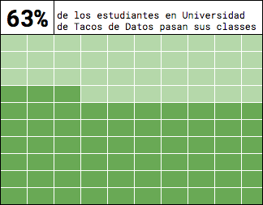
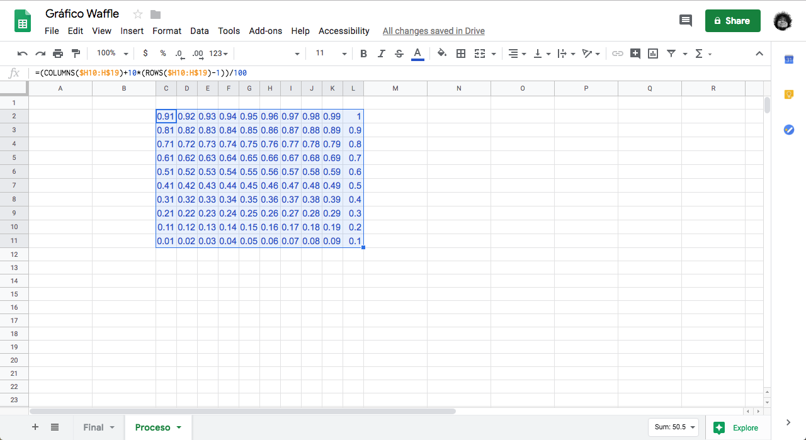
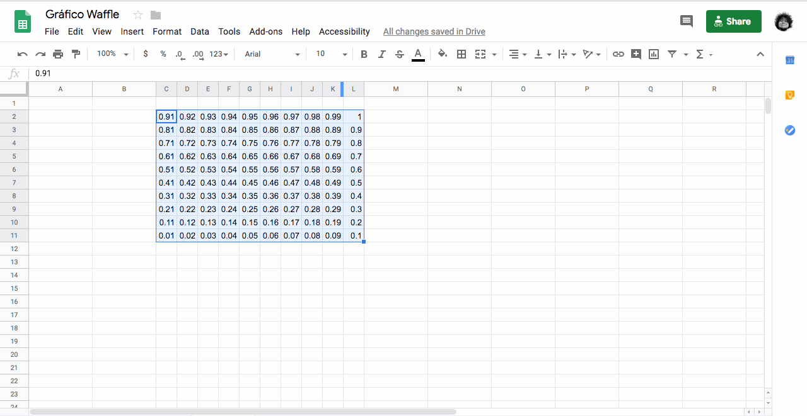
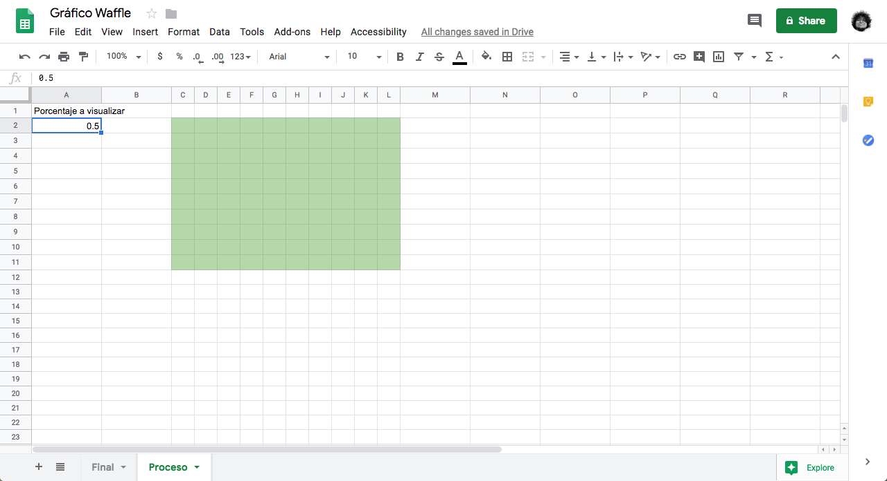
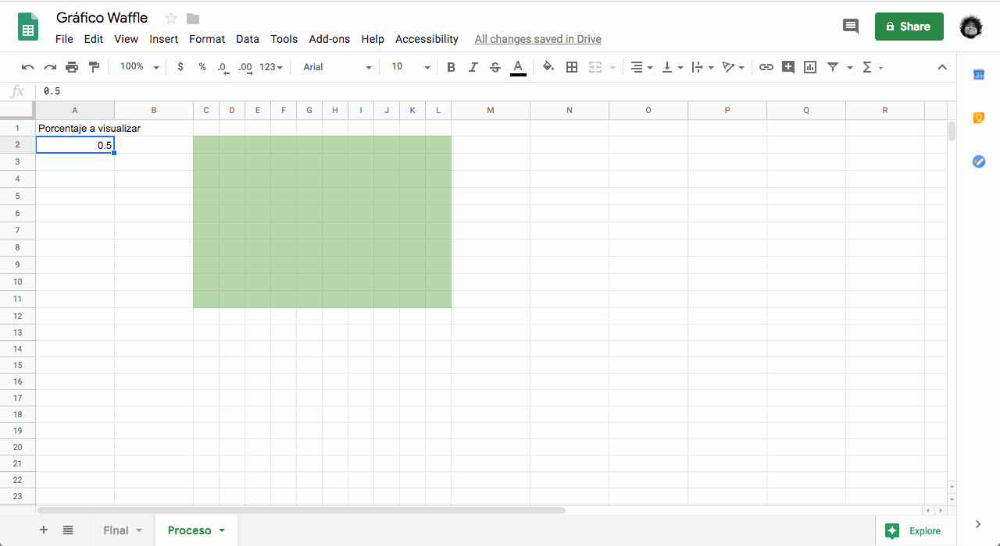
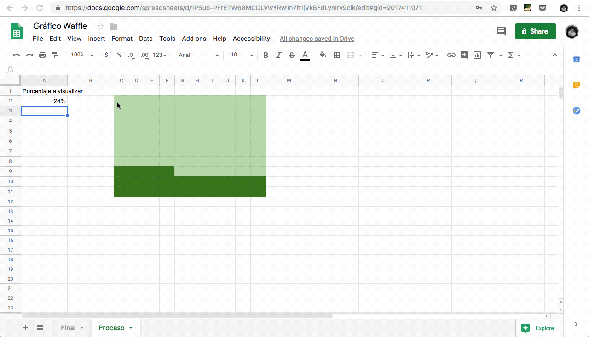
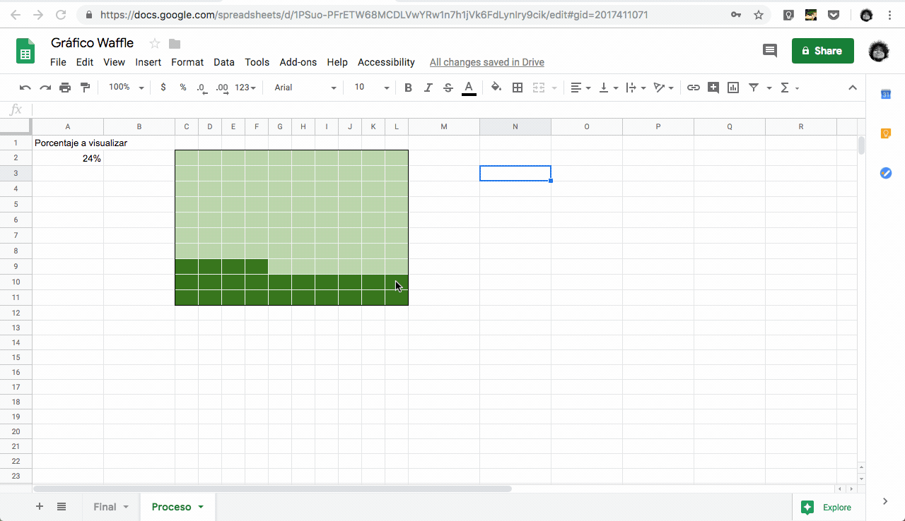

Hay veces que un gráfico pastel no es suficiente, es cuando llegan los waffles. 

En este pequeño tutorial vamos a aprender a crear este tipo de gráficos en Google Sheets ya que es más accesible - solo necesitas acceso a una cuenta de google. Todo lo que hagamos aquí funciona en Excel también.

## Paso 1: Prepara una cuadrícula 10x10.
El gráfico se crea manipulando los colores de las celdas. No es un gráfico como los más comunes en excel (de barras o líneas), es decir, no es un gráfico que _insertas_ al que le conectas celdas y modificas sus propiedades y atributos.  
Toma 10 lineas y 10 columnas, llénalas de los valores 0 a 1 en incrementos de un centésimo:

Con la siguiente formula puedes llenar más rápidamente tus celdas:
<pre>=(COLUMNS($C2:C$11)+10*(ROWS($C2:C$11)-1))/100</pre>

Yo estoy usando los valroes de C2 a C11 porque ahí comienza mi cuadrícula. Asegúrate de que tus valores concuerden con los de tu cuadrícula.

## Paso 2: Agregale el color de fondo.
Cambia el color de tus números y de las celdas al color que quieras que sea _el fondo_ de tu gráfico. Te recomiendo escoger un valor claro. En este caso utilizamos un verde claro:

## Paso 3: Escoge la celda que va a servir como indicador.
Escoge una celda que contenga el número (o porcentaje en este caso) que ilustrarás con tu waffle.
En nuestro caso va a ser la celda **A2**.  
**nota**: Aquí escogemos una valor inventado pero podrías escoger una celda que contenga alguna estadística de alguna tabla que tengas en tu planilla. La _celda indicadora_ no tiene que ser un valor estático, puede contener una fórmula - el promedio, la suma, la diferencia de otros valores.

## Paso 4: Agrega un _formato condicional_ a tu cuadrícula.
Este es el paso clave. Cuando agregas un _formato condicional_ a tu cuadrícula vas a poder _pintar_ las celdas de tu waffle _interactivamente_ modificando sólo el valor de la celda que haz escogido como indicador.

#### Ojo:
1. Cuando escoges tu _formato condicional_ tienes que escoger **igual o menor que** al valor de tu _celda indicadora_.
2. Cuando escoges tu _celda indicadora_ tienes que utilizar el formato **=$A$2**. Es decir: el signo de **=** y tu celda con los símbolos **$** antes de la letra y el número. Eso le dice a Excel y Google Sheets que esta fórmula es _estática_ y aplica así como esta a todas las celdas de tu cuadrícula. 

## Paso 5: ¡Listo!
Ya solo tienes que estilizar tu gráfico como te guste. Yo te recomiendo:
1. Utilizar bordes claros en el interior de tu cuadrícula y oscuros en el borde más externo.
    
2. Agregale un título.
    

Aqui te dejo el enlace a la planilla original en [Google Drive](https://docs.google.com/spreadsheets/d/1f1-1J7SXMn4R9OW2XwRLYs8aGy3cB9ITFoy62ZCYHQc/edit?usp=sharing)

Este tutorial esta etiquetado como **principiante** ya que solo necesitas tener acceso a una cuenta google y seguir estos simples pasos. 

Para terminar, este es el primer tutorial que publicamos sobre excel/google sheets. Estamos creciendo en **tacosdedatos** y queremos saber si te gusta el formato o tienes sugerencias. Cuéntanos que piensas de este formato en un [tuit](https://twitter.com/share?text=%40tacosdedatos+sobre+el+tutorial+yo+pienso+que+). ¿Tienes ideas o sugerencias sobre que más deberíamos cubrir en **tacosdedatos**? Envianos un correo a [✉️ sugerencias@tacosdedatos.com](mailto:sugerencias@tacosdedatos.com?subject=Sugerencia&body=Hola-holaaa).