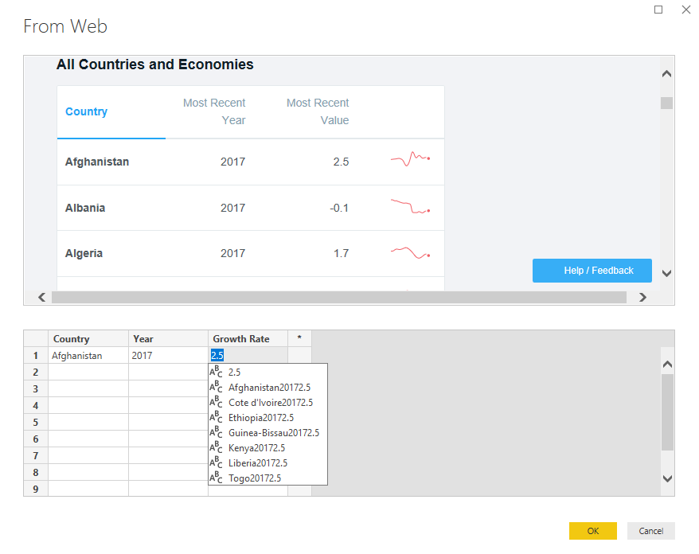

Saludos comunidad datera, en este pequeño artículo veremos lo sencillo que es conseguir datos de una página web y convertirlos en unos mapas interactivos con unos cuantos clicks.
Para este caso queremos ubicar en un mapa los países y sus tasas de crecimiento poblacional. 

### Webscrapping
Para este caso necesitamos tener instalado PowerBI, el cual es gratuito (por un mes) y completamente funcional, https://powerbi.microsoft.com/es-es/

Ya instalado, buscaremos obtener la información en la siguiente liga:

https://data.worldbank.org/indicator/SP.POP.GROW?page=6

Navegando un poquito encontramos la información que deseamos. Ahora debemos descargarla y mapearla.
Para ello utilizaremos el conector de PowerBI para páginas web.

Le indicaremos la página.

Nos saldrá este navegador y veremos los dos elementos que nos facilitaran la vida. La vista web (Web View) y agregar tablas usando ejemplos (Add table using examples).

Una vez que demos click sobre esos botones entraremos en un modo de “What you see is what you get”, en la parte de arriba veremos la página web y en la parte de abajo diseñaremos nuestra tabla, seleccionaremos la tabla que ya habíamos identificado y le iremos diciendo a Power Bi que es o que necesitamos de esa tabla.

Conforme le vamos dando forma a nuestra tabla, nos irá dando sugerencias.

Ya definimos el país, ahora seleccionemos el año.

Ahora continuemos con la tasa de crecimiento.

Llenamos una segunda línea para entrenar a PowerBI sobre lo que queremos de la página. En este caso yo solo he escrito “Albania” y en automático llenó las otras dos columnas. Hacemos un chequeo rápido y vemos los datos son correctos.

Damos click en Ok, y regresamos a nuestro navegador a la vista de tabla (Table View) y vemos como ya contamos con la información lista para cargarla a nuestro modelo.

Le daremos cargar (Load) y listo, la tabla se encontrará disponible para hacer gráficos y mapeo.

Podemos hacer tablas y gráficos con nuestros datos, pero hoy veremos como hacer nuestros mapas, sólo falta decirle a PowerBI que la columna “Country” de nuestro modelo corresponde a datos Geográficos y que son países.

Y esto por supuesto se hace con unos cuantos clicks.
Primero seleccionaremos nuestro columna “Country”, iremos a la pestaña de Modelado (Modeling) y en el menú Propiedades seleccionaremos la categoría de datos (Data Category) de País/Region (Country/Region), noten que si tuviéramos más detalle como estado o códigos postales, solo hará falta definirlos para mapearlos a el nivel que deseemos.

Una vez hecho esto aparecerá un icono de mundo justo a un lado de nuestra columna indicándonos que es un dato de categoría geográfica.

Ahora sí a mapear, seleccionaremos de nuestro panel de visualizaciones (Visuals) el gráfico “Filled map”

Utilizaremos la columna “Country” en “Location” y los valores de la columna “Growth Rate” en el campo “Tooltips”, con ello PowerBI sabrá que países colorear, pero nos falta agregarle una gama de colores que dependan de los valores de crecimiento.

Para agregarle el formato condicional seleccionamos nuestro mapa, nos dirigimos al panel de visualizaciones y seleccionamos “Data colors” damos click en “Default colors” y nos dará la opción e Formato condicional (Conditional formatting)

Configuramos la escala para que por las tasas de crecimiento coloree los países 

Ya con eso queda nuestro mapa configurado.

Otra opción es usar el gráfico “Mapbox Visual”.

Para este visual, necesitaremos un “Access token”

Una vez registrado, lo pegamos en el campo de “Access Token”

Configuramos nuestro mapa, definiendo tipo de mapa “Choropleth”

Y ya tenemos listos dos mapas, que podemos compartir en la internet mediante el servicio en línea de PowerBI.
