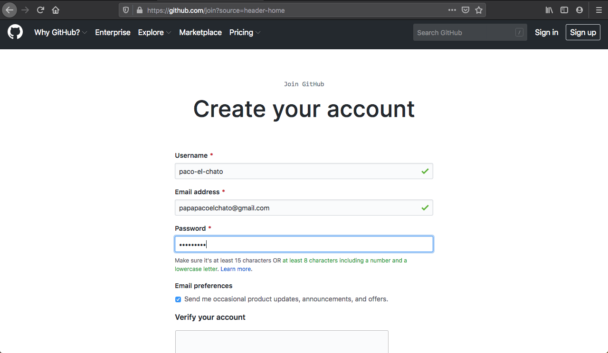
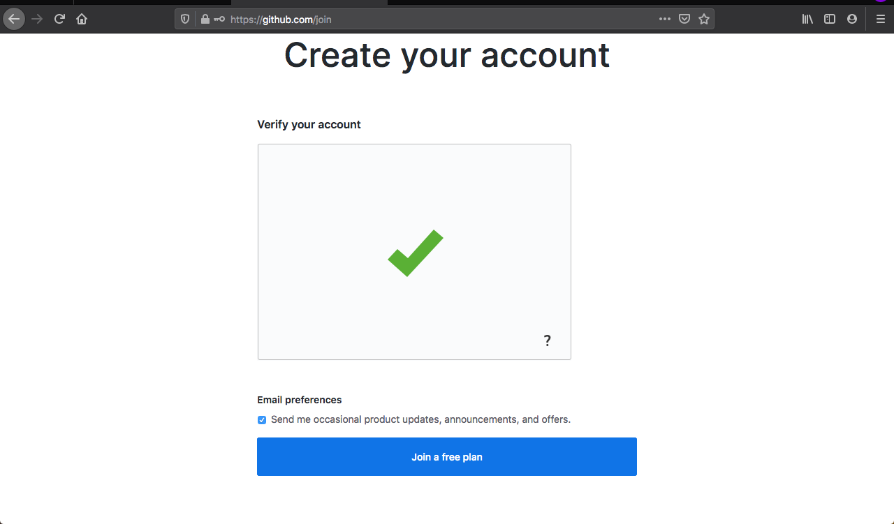
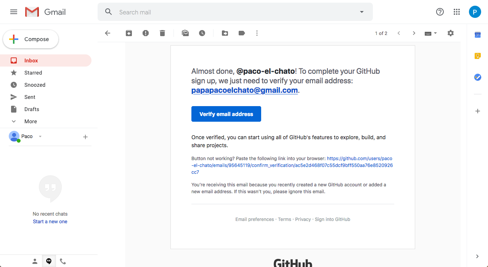
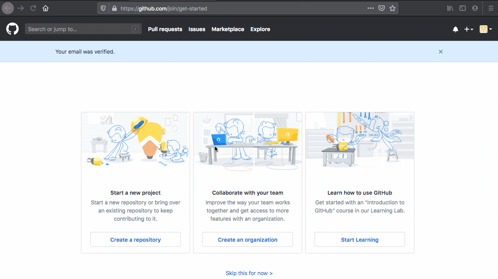
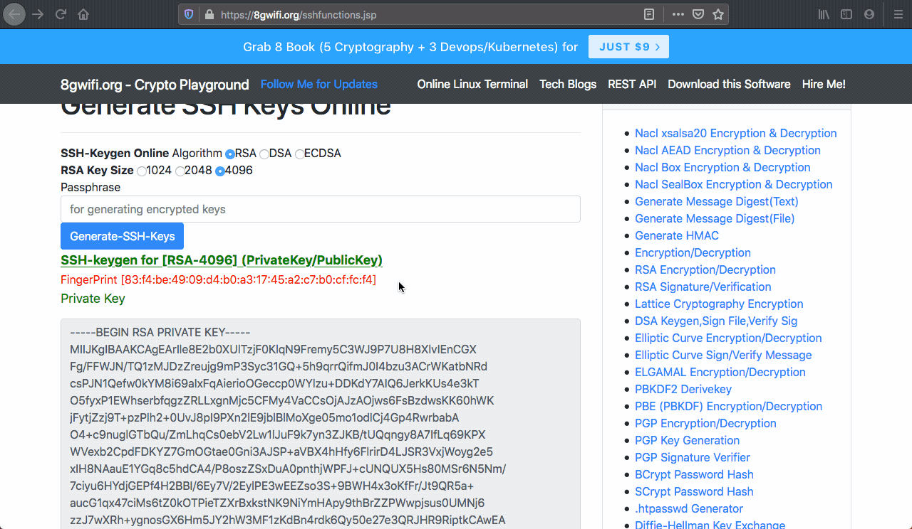
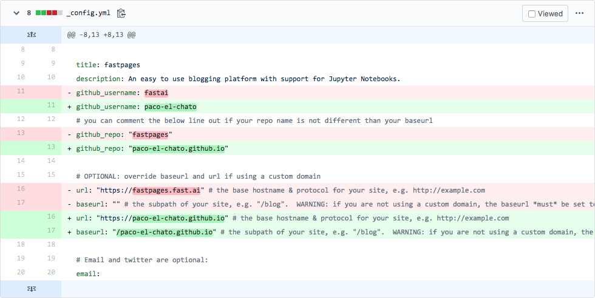
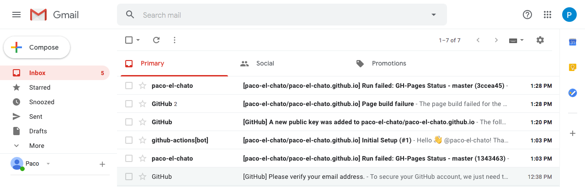
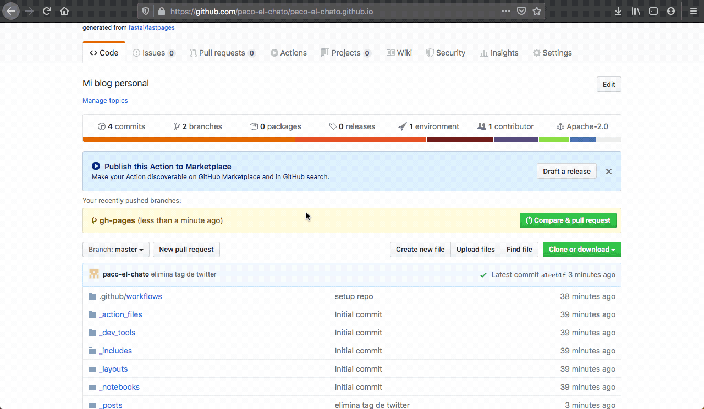
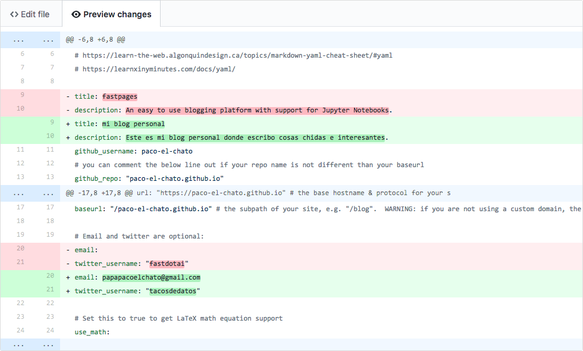
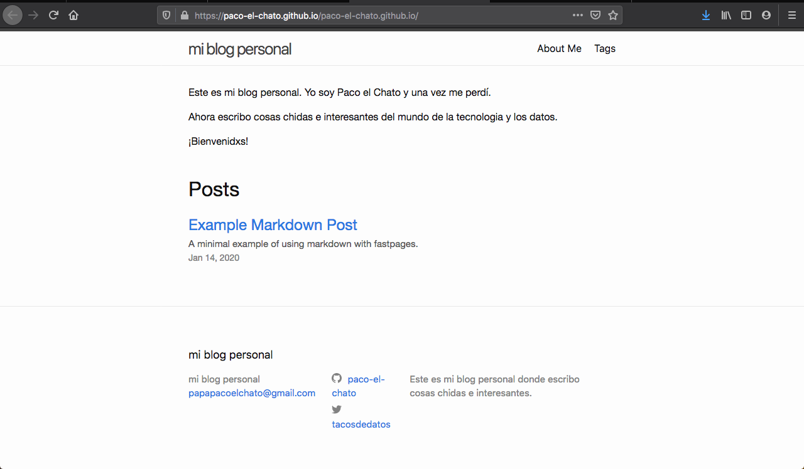

# Cómo hacer un blog con fastpages y GitHub
Hace poco lancé mi blog personal en [chekos.dev](https://chekos.dev) utilizando GitHub pages y un repositorio plantilla creado por [fast.ai](https://fast.ai/). Escribí sobre mis razones en el post [Ya se fueron las nieves de enero](https://chekos.dev/2020/02/10/las-nieves-de-enero/). 

Yo creo que todas las personas que quieren crecer en el mundo de los datos y la tecnología deberían tener un blog personal. Es una gran manera de 1) practicar tus habilidades de escritura, 2) mostrar al mundo (y empresas) lo que puedes hacer tú y porque deberían darte dinero por tu tiempo (contratarte) y 3) expandir el conocimiento para que otras personas también aprendan. 

## ¿Por qué GitHub?
GitHub, por si no conoces, es una plataforma de desarrollo donde puedes publicar y revisar código, manejar proyectos y muchas cosas más para quiénes escriben código de programación. Funciona como una red social, puedes seguir personas y ver qué proyectos están creando y trabajando, puedes darle estrellitas a tus repositorios de código favoritos, comentar y hasta proponer cambios en el código de otras personas. 

Entre los muchos servicios que ofrece GitHub está **GitHub Pages**, una forma gratuita de crear sitios web estáticos de manera fácil y gratuita. Eso es lo que usaremos para nuestro blog. 

Hay muchas maneras de crear un blog pero yo ya estoy usando GitHub para públicar y mantener mi código así que se me facilita usar GitHub Pages. Tu tal vez no estés usando GitHub **por el momento** pero es una herramienta muy poderosa y mantener y pública un blog con GitHub Pages es muy buen comienzo. 

## ¿Por qué `fastpages`?
Cómo mencioné antes, **GitHub Pages** es para sitios estáticos. Esto significa que si le pasas unos archivos HTML GitHub con guste te los pública en una página web. Pero tú no quieres escribir HTML para tu blog. Imagina tener que hacer
```html
<p>Todo <strong>comenzó</strong> por allá por el 2004</p>
<p>Yo era un <i>novato</i> cargando rap en mi aparato</p>
```
para escribir
> Todo **comenzó** por allá por el 2004  
> Yo era un *novato* cargando rap en mi aparato  

Lo más probable es que ya estés acostumbrada a escribir y estilizar tu texto con negrito o títulos grandes o subrayado etc etc tan solo dando unos clics a unos botones en Word o Google Docs. 

Si vienes del mundo de la tecnología tal vez conozcas **markdown** que es una sintaxis para embellecer tu texto pero sin hacer clic en botones. El mismo texto en markdown sería así:
```markdown
Todo **comenzó** por allá por el 2004
Yo era un *novato* cargando rap en mi aparato.
```
Las libretas jupyter o cuadernos o Notebooks te permiten utilizar markdown en sus celdas de texto. 

Aquí es donde entra `fastpages`, el repositorio base viene con 3 carpetas para tus posts:
1. `_notebooks/`
2. `_word/`
3. `_posts/`

¡Con `fastpages` puedes escribir publicaciones para tu blog en jupyter Notebooks, documentos `.docx` o markdown!

El repositorio viene con **GitHub Actions** que automáticamente convierte tus archivos a páginas HTML y las pública en tu blog. Si (todavía) no sabes markdown o no usas jupyter notebooks puedes comenzar escribiendo en Google Docs o Word y aún puedes tener un blog muy lindo en GitHub para que vayas practicando 🤘🏼

Si te interesa aprender más de la tecnología detrás de esto déjame un comentario al final de este post. 
- - - -
Si llegaste hasta acá lo más probable es que ya estés interesada en hacer un blog así que mejor ya comencemos con las instrucciones. 

## Cómo hacer el blog pues!
Vamos a crear un blog personal **desde cero**. Vamos a 
1. Crear una cuenta de GitHub
2. Crear un repositorio basado en el de `fastpages`
3. Agregar nuestra información al blog
4. Crear un post con Word, con markdown y uno con jupyter notebooks
5. Agregar un área de comentarios para que quienes nos lean puedan dejarnos saber que piensan
6. **Extra**: Los sitios de GitHub tienen una dirección como <nombre>.github.io que es más que suficiente para nosotros pero vamos a comprar un dominio y agregarlo a nuestro blog. 

¡Ámonos!

### Crear una cuenta de GitHub
Ve a [github.com/join](https://github.com/join) y sigue las instrucciones para crear una cuenta.

Después de verificar que no seas un robot (si eres un robot porfa no hagas esto) haz clic en el botón “Join a free plan” para crear una cuenta gratuita. 

Ya creada tu cuenta, GitHub te va a hacer unas preguntas para aprender un poco mas sobre ti como usuario. 

Al terminar esto te van a pedir que verifiques tu cuenta de correo. Vas a recibir un e-mail como este. Haz clic en el botón azul.

Y luego te va a preguntar si quieres crear un repositorio ya - **no lo hagas todavía**. Bueno, puedes hacerlo pero no lo ocupas hacer. Ahorita vamos a aprender como crear el repositorio para el blog.


### Crear un repositorio usando `fastpages`
Ok, ya tienes tu cuenta de GitHub. Ahora lo que tienes que hacer es ir al repositorio de [fastai/fastpages](https://github.com/fastai/fastpages) y usarlo como base para crear el tuyo. **Es importante que lo nombres <tu-nombre-de-usuario>.github.io**
En este caso creé un usuario llamado **paco-el-chato** entonces mi repositorio se tiene que llamar **paco-el-chato.github.io**.

Ya que hagas eso haz clic en “Create repository from template” y en unos segundos tendrás todo lo necesario para crear tu blog. 

Este repositorio ya viene listo para ser publicado solo tienes que agregar tu información y seguir unos cuantos pasos para automatizar la publicación de tus documentos docx o markdown o tus jupyter notebooks.

Ve a la sección de Pull Requests de tu repositorio, ahi debería aparecer una automatizada por un bot de GitHub para decirte lo que te falta hacer.
Se llama **Initial Setup**.

Son 3 pasos los que debemos seguir de aquí:
1. Crear una llave SSH
2. Agregar un **Secret** a GitHub con la llave *privada* que acabamos de crear y llamar ese **Secret** `SSH_DEPLOY_KEY`.
3. Agregar la llave *pública* como llave de desplegue para que le “demos permiso” a GitHub para modificar nuestro repositorio (cuando convierten los notebooks/docxs a html).

Si no sabes de SSH no te preocupes. Yo tampoco sabía (y de hecho todavía no entiendo muy bien que esta sucediendo aquí) pero no ocupas saber nada. Solo seguir los enlaces en tu Pull Request.

Veamos

Asegúrate de escoger `RSA` y `4096` en las opciones del primer enlace. También asegurase de dejar el espacio “passphrase” en blanco.

Ya tienes tu par de llaves. La llave privada es la primera y la vamos a utilizar para crear el **Secret** `SSH_DEPLOY_KEY`. Asegúrate de no modificar el texto. Solo toma todo el texto y lo vamos a copiar y pegar en la sección de **Secret**os en nuestro repositorio siguiendo el enlace del segundo paso en nuestra Pull Request.

Y por último, vamos a agregar la llave de desplegue para darle permiso a GitHub de modificar nuestro repositorio. Es muy importante que cuando creemos esta le demos “Allow write access” para en serio darle permiso a GitHub.
Vamos al sitio donde tomamos nuestra llave privada y tomemos la pública.

Ya con eso tienes para empezar a utilizar `fastpages` y tener tu propio blog!

Con lo que acabas de hacer le estas dando permiso a GitHub de tomar tu repositorio, convertir los archivos en las carpetas `_notebooks/`, `_word/` y `_posts/` a archivos HTML y publicarlos como tu sitio web <tu-nombre-de-usuario>.github.io/<tu-nombre-de-usuario>.github.io

Este proceso de convertir tus archivos y publicarlos se activa de manera automática cada que hay un cambio en tu repositorio. 

Esta Pull Requests lo que esta haciendo es “proponer” cambiar ciertos archivos en tu repositorio para que concuerden con tu usuario y no sean los del repositorio base.


Ahora lo único que tienes que hacer es aprobar esta Pull Request y estos cambios *activarán* el proceso automático de publicar tu blog en tu sitio web.

Veamos


No te preocupes si ves algunas fallas - GitHub trata de ser super eficiente y publicar tu blog lo mas pronto posible pero todavía no le habías dado permiso así que estaba “fallando”. El proceso que toma mas tiempo es el **CI** y puedes ver lo que esta haciendo paso por paso si vas a la sección **Actions** de tu repositorio

De hecho si ves tu correo vas a ver varios e-mails diciéndote que todo esta fallando. Eso es por lo mismo, primero hay que darle permiso a GitHub y luego ya todo va a funcionar bien. No te preocupes.


**Extra**: Si por alguna razón falla en publicarse tu blog lo mas probable es que sea este error que sigo teniendo yo. 

Lo que pasa es que el post por default que viene con el repositorio base tiene una línea de código que no funciona. Lo han intentado arreglar y a veces funciona y a veces no (no se porque). Lo que yo hice fue ir al archivo y nomas modificar esa línea lo cual activo todo el proceso de nuevo. 

Le toma de tres a cuatro minutos el proceso a GitHub así que hay que tener paciencia.


Si tenías ese problema pues ya lo resolvimos y si no pues ya todo esta bien y puedes visitar la pagina que aparece al frente de tu repositorio para visitar tu nuevo blog.


### Agregar nuestra información al blog
Como puedes ver el blog pues esta muy lindo y todo pero pues no es tuyo jaja. Para hacerlo tuyo hay que agregar nuestra información en el archivo `_config.yml` y el `index.md` para empezar. El config tiene las configuraciones de todo tu blog: el nombre, la descripción, las formas de contacto (twitter, GitHub, instagram, etc etc). Index.md es el archivo de tu página principal donde puedes darle la bienvenida a todas las personas que visiten tu blog.

Primero el config. Vamos a editarlo en nuestro navegador pero si le sabes a git puedes clonar tu repo y hacerlo de manera local.


Solo cambiamos el `title`, la  `description`, el usuario de twitter y el email. 


Haz clic en el botón verde gigante que dice “Commit changes” y listo. Esto activara una vez más la producción y publicación de tu blog pero antes de ir a verlo modifiquemos el Index.md


Espérate un minuto o dos y visita de nuevo tu blog para ver los cambios.


### Agregando posts con word, jupyter notebooks y markdown
Pues ya tienes tu blog pero ¿cómo puedes agregar contenido?

Este repositorio tiene automatizado todo. Lo único que tienes que hacer es seguir unas reglas fáciles de recordar y poner tus archivos en la carpeta adecuada.

Para publicar algo tienes que crear o subir el archivo a la carpeta adecuada. Los archivos `docx`s van a la carpeta `_word/` , los jupyter notebooks a la `_notebooks/` y los de markdown a `_posts/`. Todos estos archivos tienen que llevarla fecha de publicación en el nombre de la siguiente manera `YYYY-MM-DD-nombre-de-la-publicacion.docx`  o  `.ipynb` si es notebook o `.md` si es markdown.

Empezamos con word. Voy a crear un archivo rápido en google docs y lo voy a bajar como `.docx` y luego subirlo a GitHub en la carpeta `_word/`.

De nuevo, asegurase que el nombre sea correcto. La fecha de hoy es febrero 23 del 2020 entonces mi archivo tiene que llamarse `2020-02-23-mi-blog.docx` para que se vea publicado este mismo día.

Asegurate de agregar
```yaml
---
title: el titulo de tu publicacion
toc: true
---
```

PAUSE POR QUE NO FUNCIONA LA CONVERSION DE WORD/NOTEBOOKS TODAVIA


